# 🏛️ Agent Architectures

## 📋 Overview

Agent architectures define the structural organization and control flow of autonomous agents. This section explores different architectural patterns, design principles, and implementation approaches that determine how agents perceive, reason, and act in their environments.

## 🎯 Core Architecture Types

### 1. Reactive Architectures

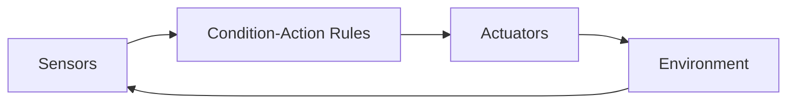

**Characteristics:**
- Direct stimulus-response mapping
- No internal state or memory
- Fast response times
- Limited reasoning capabilities

**Use Cases:** Real-time control, simple robots, reflex agents

### 2. Deliberative Architectures

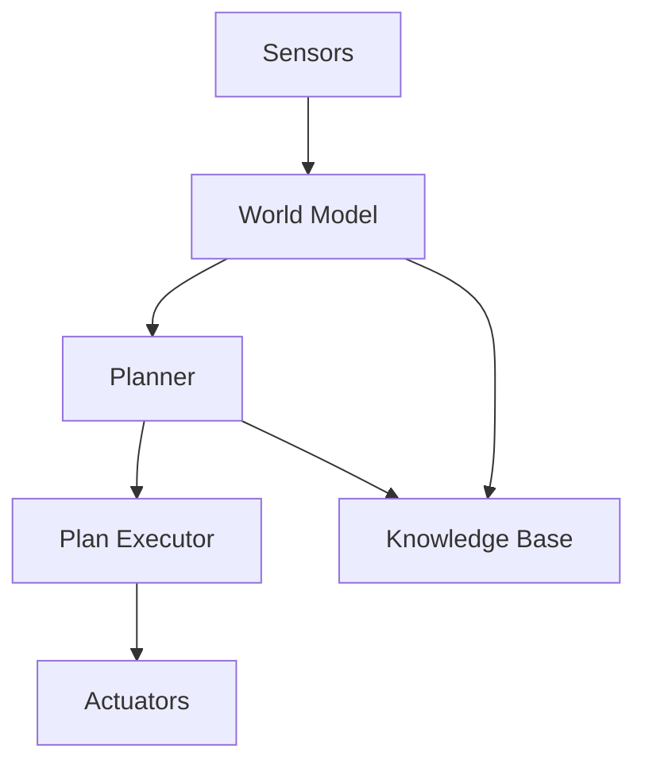

**Characteristics:**
- Symbolic reasoning and planning
- Internal world representation
- Goal-oriented behavior
- Higher computational cost

**Use Cases:** Complex problem solving, strategic planning, cognitive agents

### 3. Hybrid Architectures

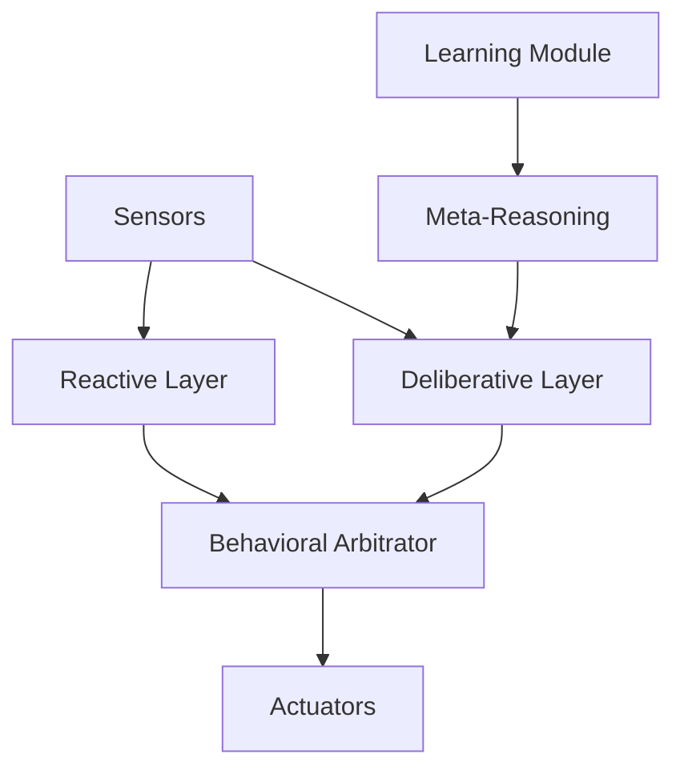

**Characteristics:**
- Combines reactive and deliberative approaches
- Multiple layers of abstraction
- Balances speed and intelligence
- Complex coordination mechanisms

**Use Cases:** Autonomous vehicles, game AI, robotics

## 🏗️ Popular Agent Architectures

### BDI (Belief-Desire-Intention) Architecture

| Component | Purpose | Implementation | Example |
|-----------|---------|----------------|---------|
| **Beliefs** | World knowledge | Knowledge base, world model | "The door is closed" |
| **Desires** | Goals and objectives | Goal stack, priority queue | "Exit the room" |
| **Intentions** | Committed plans | Plan library, execution stack | "Walk to door, turn handle" |

#### BDI Frameworks

| Framework | Language | Features | Repository |
|-----------|----------|----------|-----------|
| [Jason](http://jason.sourceforge.net/) | AgentSpeak | Logic programming | [SourceForge](http://jason.sourceforge.net/) |
| [JACK](https://aosgrp.com/products/jack/) | Java | Commercial BDI | [Website](https://aosgrp.com/products/jack/) |
| [JADEX](https://www.activecomponents.org/) | Java | Active components | [Website](https://www.activecomponents.org/) |
| [GOAL](https://goalapl.atlassian.net/) | GOAL language | Research platform | [Website](https://goalapl.atlassian.net/) |

### Subsumption Architecture

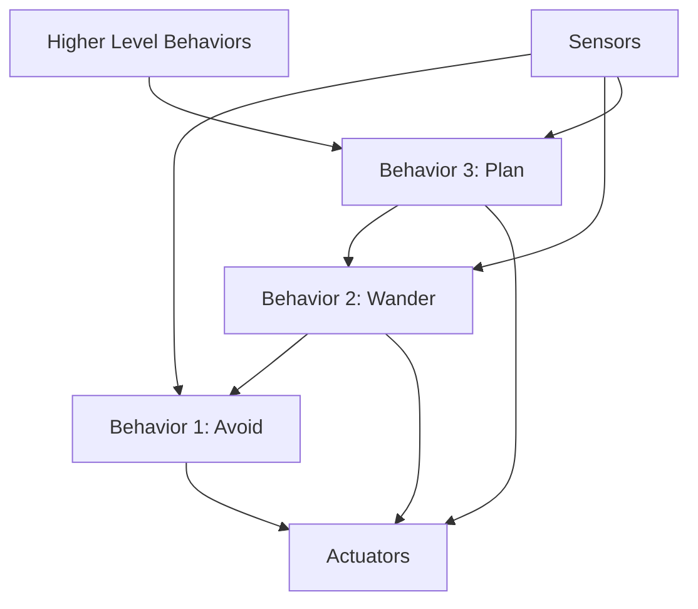

**Key Principles:**
- Behavior-based decomposition
- Subsumption hierarchy
- No central control
- Emergent intelligence

#### Subsumption Libraries

| Library | Language | Focus | Repository |
|---------|----------|-------|-----------|
| [Player/Stage](http://playerstage.sourceforge.net/) | C++ | Robot simulation | [SourceForge](http://playerstage.sourceforge.net/) |
| [MORSE](https://www.openrobots.org/morse/) | Python | Academic robotics | [GitHub](https://github.com/morse-simulator/morse) |
| [Behavior Trees](https://github.com/BehaviorTree/BehaviorTree.CPP) | C++ | Game AI, robotics | [GitHub](https://github.com/BehaviorTree/BehaviorTree.CPP) |

## 🧠 Cognitive Architectures

### ACT-R (Adaptive Control of Thought-Rational)

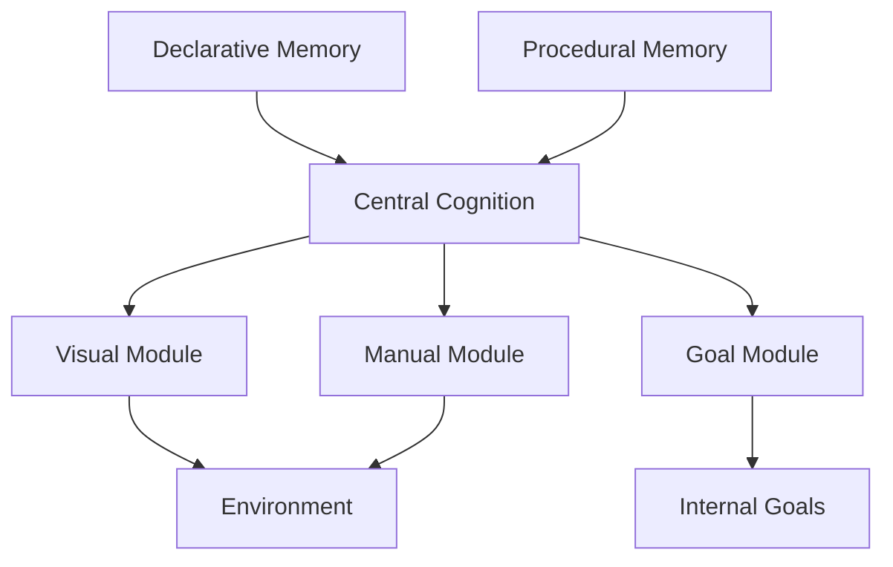

**Components:**
- Declarative knowledge (facts)
- Procedural knowledge (rules)
- Production system
- Memory buffers

| Feature | Description | Implementation |
|---------|-------------|----------------|
| **Chunks** | Declarative knowledge units | Fact representations |
| **Productions** | IF-THEN rules | Procedural knowledge |
| **Buffers** | Working memory | Limited capacity storage |
| **Modules** | Specialized processors | Vision, motor, goal |

#### ACT-R Resources

| Resource | Type | Features | Link |
|----------|------|----------|------|
| [Python ACT-R](https://github.com/jakdot/pyactr) | Implementation | Python version | [GitHub](https://github.com/jakdot/pyactr) |
| [ACT-R Tutorial](http://act-r.psy.cmu.edu/tutorials/) | Learning | Comprehensive guide | [Website](http://act-r.psy.cmu.edu/tutorials/) |
| [ACT-R Models](http://act-r.psy.cmu.edu/models/) | Examples | Model library | [Website](http://act-r.psy.cmu.edu/models/) |

### SOAR (State, Operator, And Result)

**Architecture Components:**
- Working memory (current state)
- Production memory (long-term knowledge)
- Preference memory (decision knowledge)
- Learning mechanisms

```python
# SOAR-style production rule example
class SOARProduction:
    def __init__(self, conditions, actions, preferences=None):
        self.conditions = conditions
        self.actions = actions
        self.preferences = preferences or {}
    
    def match(self, working_memory):
        return all(condition.evaluate(working_memory) 
                  for condition in self.conditions)
    
    def execute(self, working_memory):
        for action in self.actions:
            action.apply(working_memory)
```

## 🔄 Modern Agent Architectures

### Actor Model Architecture

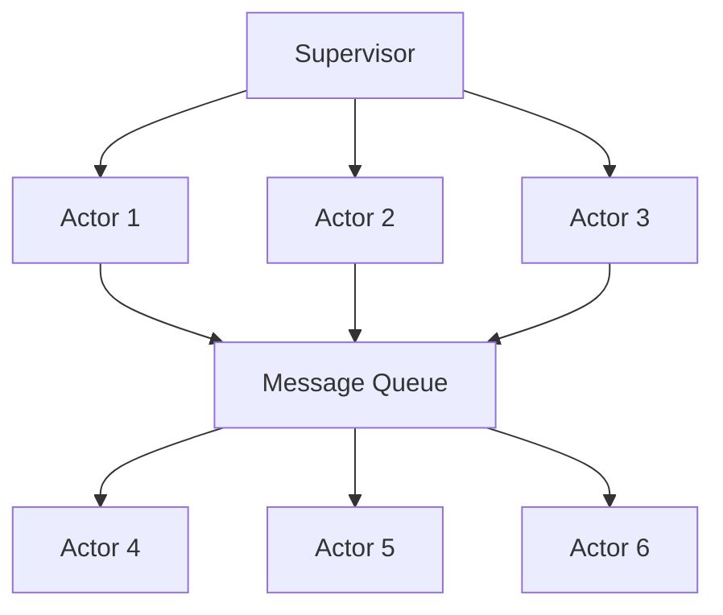

**Principles:**
- Everything is an actor
- Actors communicate via messages
- No shared state
- Fault tolerance through supervision

#### Actor Model Frameworks

| Framework | Language | Features | Repository |
|-----------|----------|----------|-----------|
| [Akka](https://akka.io/) | Scala/Java | High performance | [GitHub](https://github.com/akka/akka) |
| [Orleans](https://dotnet.github.io/orleans/) | C# | Virtual actors | [GitHub](https://github.com/dotnet/orleans) |
| [Ray](https://ray.io/) | Python | Distributed computing | [GitHub](https://github.com/ray-project/ray) |
| [Pony](https://www.ponylang.io/) | Pony | Actor language | [GitHub](https://github.com/ponylang/ponyc) |

### Microservices Architecture for Agents

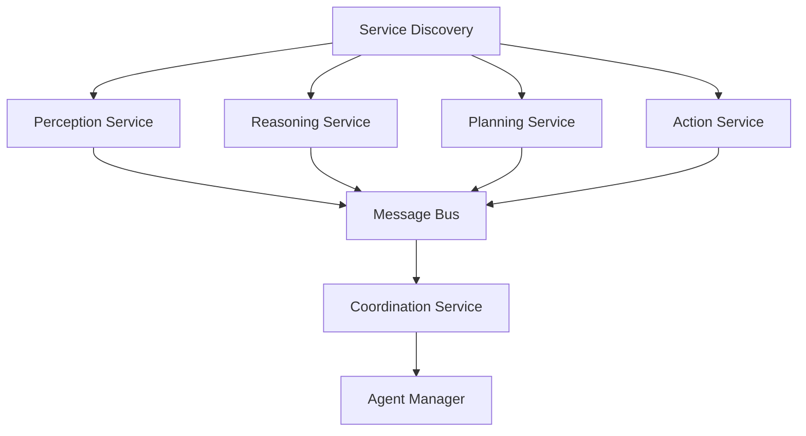

**Benefits:**
- Scalability and modularity
- Technology diversity
- Independent deployment
- Fault isolation

## 🎮 Game AI Architectures

### Finite State Machines (FSM)

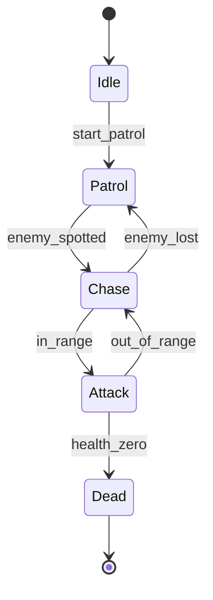

**Implementation:**
```python
from enum import Enum
from abc import ABC, abstractmethod

class State(Enum):
    IDLE = "idle"
    PATROL = "patrol" 
    CHASE = "chase"
    ATTACK = "attack"

class GameAgent:
    def __init__(self):
        self.state = State.IDLE
        self.health = 100
        self.target = None
    
    def update(self, game_world):
        if self.state == State.IDLE:
            self.handle_idle(game_world)
        elif self.state == State.PATROL:
            self.handle_patrol(game_world)
        elif self.state == State.CHASE:
            self.handle_chase(game_world)
        elif self.state == State.ATTACK:
            self.handle_attack(game_world)
    
    def transition_to(self, new_state):
        print(f"Transitioning from {self.state} to {new_state}")
        self.state = new_state
```

### Behavior Trees

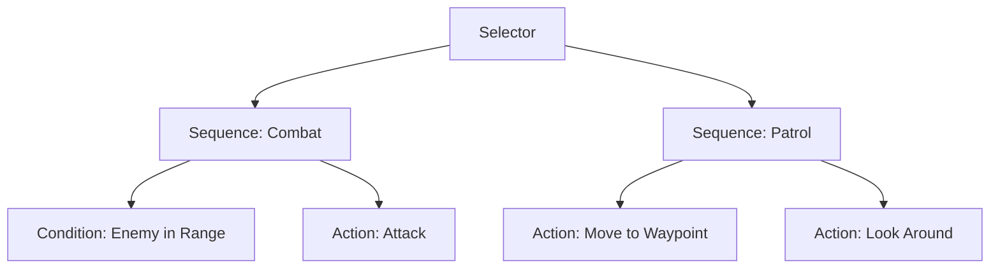

#### Behavior Tree Libraries

| Library | Language | Features | Repository |
|---------|----------|----------|-----------|
| [py_trees](https://py-trees.readthedocs.io/) | Python | Pythonic BT | [GitHub](https://github.com/splintered-reality/py_trees) |
| [BehaviorTree.CPP](https://behaviortree.dev/) | C++ | High performance | [GitHub](https://github.com/BehaviorTree/BehaviorTree.CPP) |
| [Groot](https://github.com/BehaviorTree/Groot) | C++/Qt | Visual editor | [GitHub](https://github.com/BehaviorTree/Groot) |

## 🤖 Robotic Agent Architectures

### Three-Layer Architecture

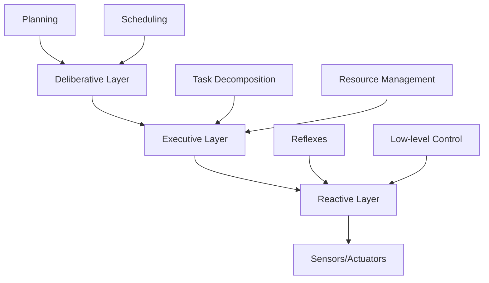

### ROS (Robot Operating System) Architecture

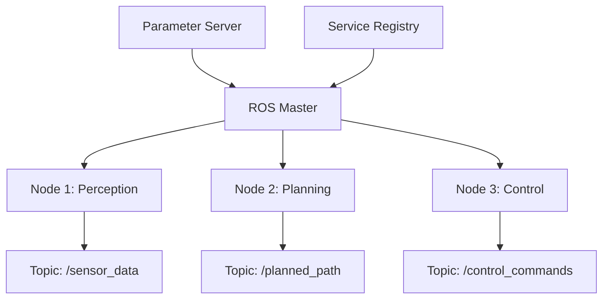

#### ROS Frameworks

| Framework | Version | Features | Repository |
|-----------|---------|----------|-----------|
| [ROS 1](http://wiki.ros.org/) | Melodic/Noetic | Mature ecosystem | [GitHub](https://github.com/ros) |
| [ROS 2](https://docs.ros.org/en/rolling/) | Humble/Iron | Real-time, security | [GitHub](https://github.com/ros2) |
| [MicroROS](https://micro.ros.org/) | Embedded | Microcontrollers | [GitHub](https://github.com/micro-ROS) |

## 📊 Architecture Comparison

### Performance Characteristics

| Architecture | Response Time | Reasoning Capability | Scalability | Complexity |
|-------------|---------------|---------------------|-------------|------------|
| **Reactive** | Very Fast | Limited | Good | Low |
| **Deliberative** | Slow | High | Limited | High |
| **Hybrid** | Medium | Medium-High | Good | Medium-High |
| **BDI** | Medium | High | Medium | High |
| **Subsumption** | Fast | Emergent | Excellent | Medium |

### Selection Criteria

| Use Case | Recommended Architecture | Reasoning |
|----------|-------------------------|-----------|
| **Real-time Control** | Reactive/Subsumption | Speed critical |
| **Strategic Planning** | Deliberative/BDI | Complex reasoning needed |
| **Game AI** | FSM/Behavior Trees | Predictable behavior |
| **Robotics** | Hybrid/Three-layer | Balance of speed and intelligence |
| **Distributed Systems** | Actor Model | Scalability and fault tolerance |

## 🔧 Implementation Patterns

### Agent Interface Pattern

```python
from abc import ABC, abstractmethod
from typing import Any, Dict, List

class Agent(ABC):
    def __init__(self, agent_id: str):
        self.id = agent_id
        self.beliefs = {}
        self.goals = []
        self.plans = []
    
    @abstractmethod
    def perceive(self, environment: Any) -> Dict[str, Any]:
        """Sense the environment and update beliefs"""
        pass
    
    @abstractmethod
    def decide(self) -> str:
        """Choose an action based on current state"""
        pass
    
    @abstractmethod
    def act(self, action: str, environment: Any) -> None:
        """Execute the chosen action"""
        pass
    
    def update(self, environment: Any) -> None:
        """Main agent loop"""
        percepts = self.perceive(environment)
        self.update_beliefs(percepts)
        action = self.decide()
        self.act(action, environment)
    
    def update_beliefs(self, percepts: Dict[str, Any]) -> None:
        """Update internal beliefs based on percepts"""
        self.beliefs.update(percepts)
```

### Layered Architecture Pattern

```python
class LayeredAgent:
    def __init__(self):
        self.reactive_layer = ReactiveLayer()
        self.deliberative_layer = DeliberativeLayer()
        self.meta_layer = MetaLayer()
        
        self.current_plan = None
        self.emergency_action = None
    
    def update(self, percepts):
        # Meta-layer reasoning
        strategy = self.meta_layer.select_strategy(percepts)
        
        # Deliberative planning
        if strategy == "plan":
            self.current_plan = self.deliberative_layer.plan(percepts)
        
        # Check for emergency conditions
        self.emergency_action = self.reactive_layer.check_emergency(percepts)
        
        # Action selection
        if self.emergency_action:
            return self.emergency_action
        elif self.current_plan:
            return self.current_plan.next_action()
        else:
            return self.reactive_layer.default_action(percepts)
```

## 📚 Learning Resources

### Books & References
- **"Multiagent Systems"** by Gerhard Weiss
- **"An Introduction to MultiAgent Systems"** by Michael Wooldridge  
- **"Artificial Intelligence: Foundations of Computational Agents"** by Poole & Mackworth

### Courses & Tutorials
- [Agent-Based Systems](https://www.coursera.org/learn/agent-based-systems) - University of Edinburgh
- [ROS Tutorials](http://wiki.ros.org/ROS/Tutorials) - Robot Operating System
- [Game AI Programming](https://www.gameaipro.com/) - Free online book

### Research Papers
- "The Belief-Desire-Intention Model of Agency" - Bratman (1987)
- "Layered Learning in Multiagent Systems" - Stone & Veloso (2000)
- "Behavior-Based Robotics" - Arkin (1998)

## 🔗 Related Topics

- [Task Decomposition](./Task-Decomposition.md)
- [Communication Protocols](./Communication-Protocols.md)
- [Multi-Agent Systems](../Core-Concepts/Multi-Agent-Systems.md)
- [Decision Making & Planning](../Core-Concepts/Decision-Making-Planning.md)

---

*This document provides comprehensive coverage of agent architectures for autonomous systems. For specific implementation guidance, refer to the framework documentation and practical examples provided.*