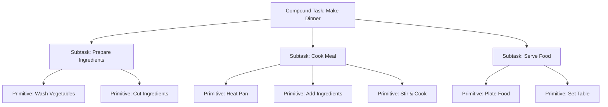

# ⚡ Task Decomposition

## 📋 Overview

Task decomposition is the process of breaking down complex goals into manageable subtasks that agents can execute. This is fundamental to agent systems, enabling them to solve problems that would be intractable as single monolithic tasks.

## 🎯 Core Concepts

### Why Task Decomposition?

**Benefits:**
- **Simplicity**: Break complex problems into simpler pieces
- **Reusability**: Subtasks can be reused across different goals
- **Parallelization**: Independent subtasks can run concurrently
- **Maintainability**: Easier to debug and modify
- **Scalability**: Handle increasingly complex problems

### Decomposition Principles

1. **Top-Down**: Start with high-level goal, recursively decompose
2. **Bottom-Up**: Combine primitive actions into complex behaviors
3. **Hierarchical**: Multiple levels of abstraction
4. **Modular**: Independent, loosely-coupled subtasks

## 🌳 Hierarchical Task Networks (HTN)

### HTN Overview



### HTN Components

| Component | Description | Example |
|-----------|-------------|---------|
| **Compound Task** | High-level task requiring decomposition | "Navigate to location" |
| **Primitive Task** | Directly executable action | "Move forward 1 meter" |
| **Methods** | Ways to decompose compound tasks | Different navigation strategies |
| **Preconditions** | Required state before execution | Robot must be powered on |
| **Effects** | State changes after execution | Robot position updated |

### HTN Planning Example

```python
class HTNPlanner:
    def __init__(self, methods, primitives):
        self.methods = methods  # Decomposition methods
        self.primitives = primitives  # Executable actions
        
    def plan(self, tasks, state):
        """
        HTN planning algorithm
        
        Args:
            tasks: List of tasks to accomplish
            state: Current world state
            
        Returns:
            List of primitive actions to execute
        """
        if not tasks:
            return []  # No tasks, empty plan
        
        task = tasks[0]
        remaining = tasks[1:]
        
        # Check if task is primitive
        if task in self.primitives:
            if self.is_applicable(task, state):
                new_state = self.apply(task, state)
                rest_plan = self.plan(remaining, new_state)
                if rest_plan is not None:
                    return [task] + rest_plan
            return None
        
        # Task is compound, try all methods
        for method in self.methods.get(task, []):
            if self.satisfies_preconditions(method, state):
                subtasks = method.decompose(state)
                plan = self.plan(subtasks + remaining, state)
                if plan is not None:
                    return plan
        
        return None  # No applicable method found
```

## 🎯 Goal Trees

### Goal-Oriented Action Planning (GOAP)

```python
from enum import Enum
from dataclasses import dataclass
from typing import List, Optional

class GoalStatus(Enum):
    PENDING = "pending"
    ACTIVE = "active"
    COMPLETED = "completed"
    FAILED = "failed"

@dataclass
class Goal:
    """Hierarchical goal representation"""
    name: str
    priority: int
    status: GoalStatus
    preconditions: List[callable]
    success_conditions: List[callable]
    subgoals: List['Goal']
    parent: Optional['Goal'] = None
    
    def can_activate(self, state):
        """Check if goal can be activated"""
        return all(cond(state) for cond in self.preconditions)
    
    def is_achieved(self, state):
        """Check if goal is completed"""
        return all(cond(state) for cond in self.success_conditions)
    
    def activate(self):
        """Activate this goal"""
        if self.status == GoalStatus.PENDING:
            self.status = GoalStatus.ACTIVE
            if self.subgoals:
                self.subgoals[0].activate()
    
    def process(self, state):
        """Process goal execution"""
        if self.status != GoalStatus.ACTIVE:
            return
        
        if self.is_achieved(state):
            self.status = GoalStatus.COMPLETED
            if self.parent:
                self.parent.handle_subgoal_completion(self)
            return
        
        # Process active subgoals
        for subgoal in self.subgoals:
            if subgoal.status == GoalStatus.ACTIVE:
                subgoal.process(state)
                return
```

## 🌲 Behavior Trees

### Behavior Tree Nodes

```python
from abc import ABC, abstractmethod
from enum import Enum

class NodeStatus(Enum):
    SUCCESS = "success"
    FAILURE = "failure"
    RUNNING = "running"

class BehaviorNode(ABC):
    """Base class for behavior tree nodes"""
    
    @abstractmethod
    def tick(self, agent, blackboard):
        """Execute node logic"""
        pass

class SequenceNode(BehaviorNode):
    """Execute children in sequence until one fails"""
    
    def __init__(self, children):
        self.children = children
        self.current_child = 0
    
    def tick(self, agent, blackboard):
        while self.current_child < len(self.children):
            child = self.children[self.current_child]
            status = child.tick(agent, blackboard)
            
            if status == NodeStatus.FAILURE:
                self.current_child = 0
                return NodeStatus.FAILURE
            elif status == NodeStatus.RUNNING:
                return NodeStatus.RUNNING
            
            self.current_child += 1
        
        self.current_child = 0
        return NodeStatus.SUCCESS

class SelectorNode(BehaviorNode):
    """Execute children until one succeeds"""
    
    def __init__(self, children):
        self.children = children
        self.current_child = 0
    
    def tick(self, agent, blackboard):
        while self.current_child < len(self.children):
            child = self.children[self.current_child]
            status = child.tick(agent, blackboard)
            
            if status == NodeStatus.SUCCESS:
                self.current_child = 0
                return NodeStatus.SUCCESS
            elif status == NodeStatus.RUNNING:
                return NodeStatus.RUNNING
            
            self.current_child += 1
        
        self.current_child = 0
        return NodeStatus.FAILURE
```

## 📊 Task Dependencies

### Dependency Graph Management

```python
from collections import defaultdict, deque

class TaskDependencyGraph:
    """Manage task dependencies"""
    
    def __init__(self):
        self.graph = defaultdict(list)
        self.in_degree = defaultdict(int)
        self.tasks = {}
    
    def add_task(self, task_id, task):
        """Add a task to the graph"""
        self.tasks[task_id] = task
        if task_id not in self.in_degree:
            self.in_degree[task_id] = 0
    
    def add_dependency(self, from_task, to_task):
        """Add dependency: to_task depends on from_task"""
        self.graph[from_task].append(to_task)
        self.in_degree[to_task] += 1
    
    def topological_sort(self):
        """Get valid execution order"""
        queue = deque()
        result = []
        
        # Find all tasks with no dependencies
        for task_id in self.tasks:
            if self.in_degree[task_id] == 0:
                queue.append(task_id)
        
        while queue:
            task_id = queue.popleft()
            result.append(task_id)
            
            for dependent in self.graph[task_id]:
                self.in_degree[dependent] -= 1
                if self.in_degree[dependent] == 0:
                    queue.append(dependent)
        
        if len(result) != len(self.tasks):
            raise ValueError("Circular dependency detected!")
        
        return result
```

## 🔧 Libraries & Tools

### HTN Planning

| Library | Language | Features | Repository |
|---------|----------|----------|-----------|
| [PyHOP](https://github.com/gjf2a/pyhop) | Python | Simple HTN planner | [GitHub](https://github.com/gjf2a/pyhop) |
| [SHOP2](https://www.cs.umd.edu/projects/shop/) | Lisp | Advanced HTN | [Website](https://www.cs.umd.edu/projects/shop/) |

### Behavior Trees

| Library | Language | Features | Repository |
|---------|----------|----------|-----------|
| [py_trees](https://github.com/splintered-reality/py_trees) | Python | Full-featured BT | [GitHub](https://github.com/splintered-reality/py_trees) |
| [BehaviorTree.CPP](https://www.behaviortree.dev/) | C++ | High-performance | [GitHub](https://github.com/BehaviorTree/BehaviorTree.CPP) |

### PDDL Planning

| Tool | Description | Link |
|------|-------------|------|
| [Fast Downward](http://www.fast-downward.org/) | State-of-the-art planner | [Website](http://www.fast-downward.org/) |
| [pyperplan](https://github.com/aibasel/pyperplan) | Python PDDL planner | [GitHub](https://github.com/aibasel/pyperplan) |

## 📚 Learning Resources

### Books
- **"Automated Planning: Theory and Practice"** by Ghallab, Nau, Traverso
- **"Behavior Trees in Robotics and AI"** by Colledanchise & Ögren
- **"Artificial Intelligence: A Modern Approach"** - Planning chapters

### Papers
- "HTN Planning: Complexity and Expressivity" - Erol et al.
- "Behavior Trees: A Survey" - Iovino et al.
- "STRIPS: A New Approach to Planning" - Fikes & Nilsson

### Courses
- **AI Planning** - University of Edinburgh
- **Automated Planning** - Carnegie Mellon 15-888

## 🔗 Related Topics

- [Decision Making & Planning](../Core-Concepts/Decision-Making-Planning.md)
- [Agent Architectures](./Agent-Architectures.md)
- [Multi-Agent Systems](../Core-Concepts/Multi-Agent-Systems.md)
- [Reasoning & Problem Solving](../Core-Concepts/Reasoning-Problem-Solving.md)

---

*This document provides comprehensive coverage of task decomposition techniques for autonomous agents. For specific implementation guidance, refer to the framework documentation and code examples provided.*