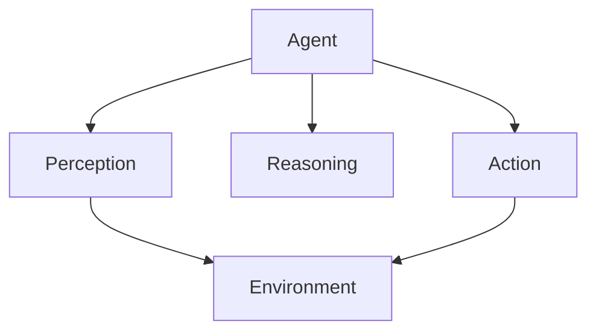

# 🎨 Assets Directory

This directory contains visual resources for the Agentic AI Engineering repository.

## 📁 Structure

### Diagrams/
Contains architectural diagrams, flowcharts, and system design visuals:
- Agent architecture diagrams
- System flow diagrams
- Decision tree visualizations
- Network topology diagrams

### Charts/
Contains comparison charts, feature matrices, and data visualizations:
- Framework comparison charts
- Performance benchmarks
- Feature matrices
- Learning path roadmaps

## 🎨 Contributing Visual Content

### Format Guidelines
- **Diagrams**: SVG (preferred) or PNG (min 300 DPI)
- **Charts**: SVG (preferred) or PNG (high resolution)
- **File naming**: `lowercase-with-hyphens.svg` or `.png`

### Tools for Creating Diagrams
- [Draw.io](https://draw.io) - Free diagramming tool
- [Mermaid](https://mermaid.js.org/) - Markdown-based diagrams
- [Excalidraw](https://excalidraw.com/) - Sketchy diagrams
- [PlantUML](https://plantuml.com/) - Text-to-diagram

### Example Mermaid Diagram

### Contribution Process
1. Create high-quality visual content
2. Save in appropriate subdirectory
3. Reference in relevant markdown files
4. Submit pull request with description

## 📝 Image Attribution

All images should either be:
- Original work (preferred)
- Licensed under Creative Commons or similar
- Properly attributed with source links

## 🔗 Related

- See [CONTRIBUTING.md](../CONTRIBUTING.md) for general guidelines
- Check existing diagrams before creating new ones
- Maintain consistent visual style across assets

---

*Visual content helps make complex concepts accessible. Your contributions are valuable!*