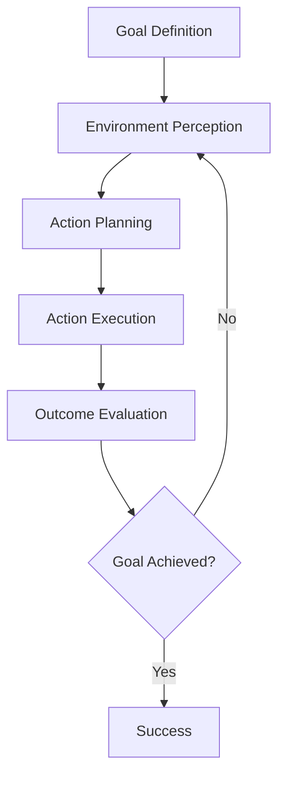

# 🤖 Autonomy & Agency

## 📋 Overview

Autonomy and agency form the foundational concepts of agentic AI systems. This section explores how AI systems can operate independently, make decisions without constant human intervention, and exhibit goal-directed behavior.

## 🎯 Key Concepts

### Autonomy
- **Definition**: The ability of a system to operate independently without external control
- **Levels**: From reactive responses to full cognitive autonomy
- **Characteristics**: Self-governance, independence, self-determination

### Agency
- **Definition**: The capacity to act in an environment to achieve goals
- **Components**: Perception, reasoning, action
- **Types**: Rational agents, learning agents, reactive agents

## 🏗️ Agent Architectures

| Architecture Type | Description | Use Cases | Pros | Cons |
|------------------|-------------|-----------|------|------|
| **Reactive** | Direct stimulus-response mapping | Real-time systems, robotics | Fast response, simple | Limited reasoning |
| **Deliberative** | Planning-based decision making | Complex problem solving | Strategic thinking | Computationally expensive |
| **Hybrid** | Combines reactive and deliberative | Autonomous vehicles, games | Balanced approach | Complex to design |
| **BDI (Belief-Desire-Intention)** | Mental state-based reasoning | Cognitive agents | Human-like reasoning | Complex implementation |

## 🛠️ Open Source Frameworks

### Agent Development Platforms

| Framework | Language | Focus | Features | Repository |
|-----------|----------|-------|----------|-----------|
| [JADE](https://jade.tilab.com/) | Java | Multi-agent systems | FIPA compliant, distributed | [GitHub](https://github.com/EmmanuelADAM/JadeUPHF) |
| [SPADE](https://spade-mas.readthedocs.io/) | Python | XMPP-based agents | Real-time messaging, web interface | [GitHub](https://github.com/javipalanca/spade) |
| [Mesa](https://mesa.readthedocs.io/) | Python | Agent-based modeling | Visualization, data collection | [GitHub](https://github.com/projectmesa/mesa) |
| [Jason](http://jason.sourceforge.net/) | AgentSpeak | BDI agents | Logic-based programming | [SourceForge](http://jason.sourceforge.net/) |
| [Repast](https://repast.github.io/) | Java/Python | Large-scale simulations | HPC support, visualization | [GitHub](https://github.com/Repast) |

### Cognitive Architectures

| Architecture | Language | Approach | Applications | Repository |
|-------------|----------|----------|-------------|-----------|
| [ACT-R](http://act-r.psy.cmu.edu/) | Lisp/Python | Cognitive modeling | Psychology, HCI | [GitHub](https://github.com/asmaloney/ACT-R) |
| [SOAR](https://soar.eecs.umich.edu/) | C++/Java | Problem solving | Game AI, robotics | [GitHub](https://github.com/SoarGroup/Soar) |
| [OpenCog](https://opencog.org/) | C++/Python | AGI framework | Research, experimentation | [GitHub](https://github.com/opencog/opencog) |

## 📚 Core Principles

### 1. Goal-Oriented Behavior


### 2. Autonomy Levels
- **Level 0**: No autonomy (human-controlled)
- **Level 1**: Assistance (human-guided with automated features)
- **Level 2**: Partial autonomy (automated with human oversight)
- **Level 3**: Conditional autonomy (system handles most tasks)
- **Level 4**: High autonomy (minimal human intervention)
- **Level 5**: Full autonomy (no human intervention required)

### 3. Agency Components
- **Sensors**: Perception of environment
- **Actuators**: Interaction with environment
- **Reasoning Engine**: Decision-making processes
- **Knowledge Base**: Stored information and experiences
- **Goals**: Desired outcomes and objectives

## 🔬 Research Areas

### Active Research Topics
| Topic | Description | Key Challenges | Recent Papers |
|-------|-------------|----------------|---------------|
| **Emergent Autonomy** | Self-organizing autonomous behavior | Predictability, control | [arXiv:2310.xxxxx](https://arxiv.org) |
| **Human-AI Collaboration** | Shared autonomy between humans and AI | Trust, transparency | [Nature AI 2024](https://nature.com) |
| **Autonomous Goal Setting** | Self-directed goal formation | Value alignment | [ICML 2024](https://icml.cc) |
| **Adaptive Autonomy** | Dynamic adjustment of autonomy levels | Context awareness | [NeurIPS 2024](https://neurips.cc) |

## 🎯 Practical Applications

### Robotics
- **Autonomous Navigation**: Path planning and obstacle avoidance
- **Manipulation**: Object grasping and manipulation
- **Human-Robot Interaction**: Collaborative robotics

### Software Agents
- **Personal Assistants**: Task automation and scheduling
- **Recommendation Systems**: Content and product suggestions
- **Trading Agents**: Automated financial decision making

### Autonomous Vehicles
- **Self-Driving Cars**: Navigation and traffic management
- **Drones**: Surveillance and delivery
- **Maritime Vessels**: Autonomous shipping

## 📖 Learning Resources

### Free Courses
| Course | Provider | Duration | Level | Link |
|--------|----------|----------|-------|------|
| Artificial Intelligence | edX (MIT) | 12 weeks | Intermediate | [MIT 6.034x](https://www.edx.org/course/artificial-intelligence-mit-6-034x) |
| AI Planning | Coursera (University of Edinburgh) | 6 weeks | Advanced | [AI Planning](https://www.coursera.org/learn/ai-planning) |
| Multi-Agent Systems | FutureLearn | 4 weeks | Intermediate | [Multi-Agent Systems](https://www.futurelearn.com/courses/multi-agent-systems) |

### Books & Papers
- **"Artificial Intelligence: A Modern Approach"** by Russell & Norvig (Chapters 2-4)
- **"Multiagent Systems: Algorithmic, Game-Theoretic, and Logical Foundations"** by Shoham & Leyton-Brown
- **"The Cambridge Handbook of Artificial Intelligence"** - Autonomy chapters

### Tutorials & Guides
- [Agent-Based Modeling with Mesa](https://mesa.readthedocs.io/en/stable/tutorials/intro_tutorial.html)
- [Building Autonomous Agents with Python](https://realpython.com/python-autonomous-agents/)
- [JADE Tutorial](https://jade.tilab.com/documentation/tutorials/)

## 🧪 Hands-On Examples

### Simple Reactive Agent (Python)
```python
class ReactiveAgent:
    def __init__(self, goal):
        self.goal = goal
        self.rules = {}
    
    def perceive(self, environment):
        return environment.get_state()
    
    def decide(self, percept):
        for condition, action in self.rules.items():
            if condition(percept):
                return action
        return None
    
    def act(self, action, environment):
        if action:
            environment.execute(action)

# Example usage
agent = ReactiveAgent("reach_target")
agent.rules[lambda x: x['target_visible']] = "move_to_target"
```

### BDI Agent Pseudocode
```python
class BDIAgent:
    def __init__(self):
        self.beliefs = {}
        self.desires = []
        self.intentions = []
    
    def update_beliefs(self, percepts):
        # Update internal world model
        pass
    
    def generate_options(self):
        # Generate possible actions based on desires
        pass
    
    def deliberate(self, options):
        # Choose intentions from options
        pass
    
    def execute_intentions(self):
        # Act on chosen intentions
        pass
```

## 🔗 Related Topics

- [Decision Making & Planning](./Decision-Making-Planning.md)
- [Multi-Agent Systems](./Multi-Agent-Systems.md)
- [Agent Architectures](../Architecture-Design/Agent-Architectures.md)
- [Reasoning & Problem Solving](./Reasoning-Problem-Solving.md)

## 📊 Performance Metrics

### Autonomy Assessment
- **Decision Independence**: Percentage of decisions made without human input
- **Goal Achievement Rate**: Success in reaching objectives
- **Adaptation Speed**: Time to adjust to environmental changes
- **Resource Efficiency**: Optimal use of computational and physical resources

### Agency Evaluation
- **Action Effectiveness**: Success rate of chosen actions
- **Environmental Coverage**: Range of environments successfully navigated
- **Robustness**: Performance under uncertainty and noise
- **Learning Rate**: Speed of improvement over time

---

*This document provides foundational knowledge for understanding autonomy and agency in AI systems. For implementation details, refer to the specific framework documentation and related architecture guides.*