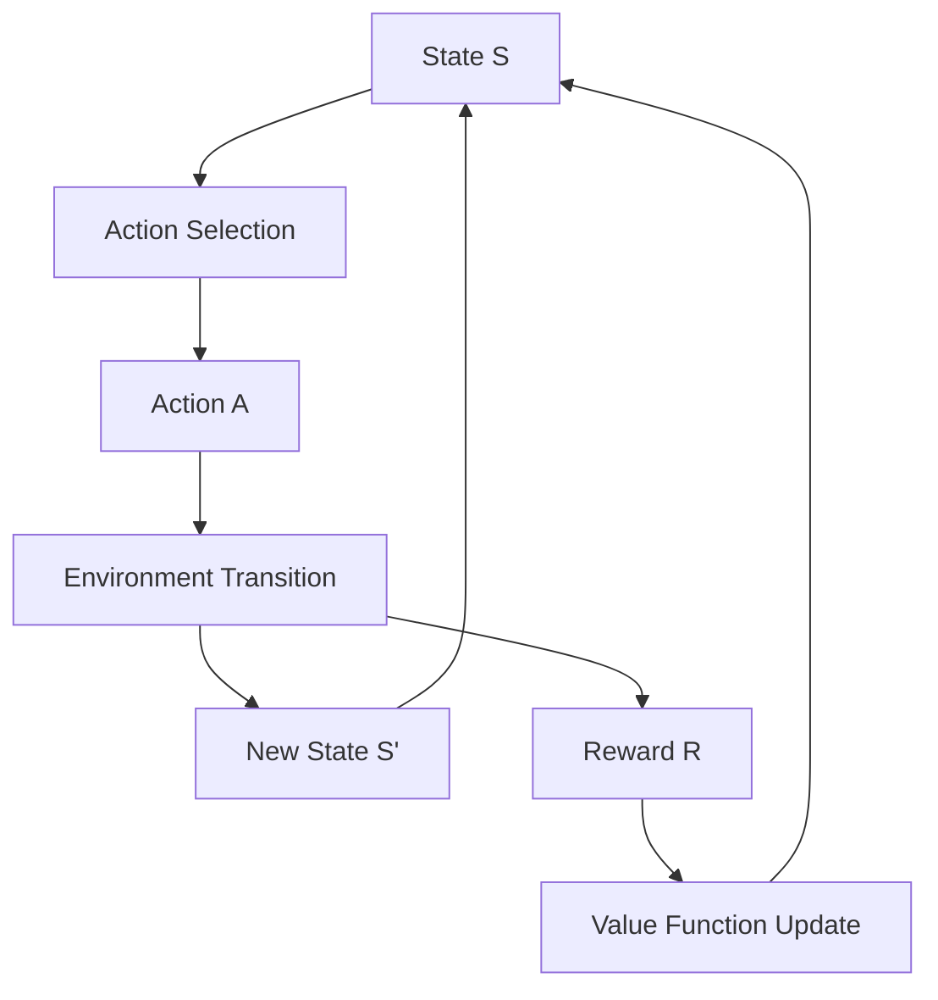
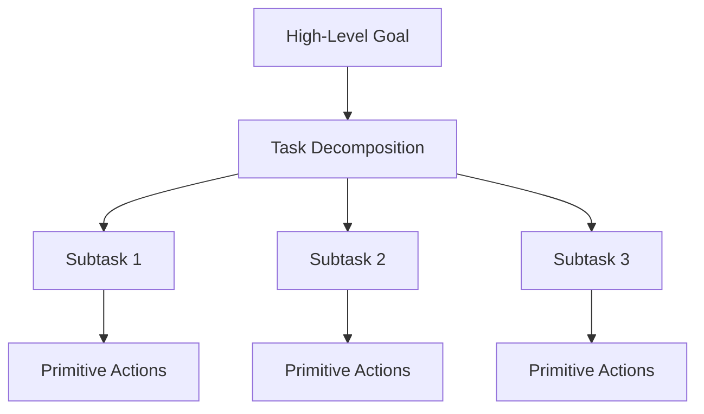

# 🧠 Decision Making & Planning

## 📋 Overview

Decision making and planning are critical components of autonomous agents, enabling them to choose optimal actions and formulate strategies to achieve their goals. This section covers algorithms, frameworks, and methodologies for intelligent decision-making in AI systems.

## 🎯 Core Concepts

### Decision Making
- **Definition**: The process of selecting actions from available alternatives
- **Types**: Deterministic, stochastic, multi-criteria, sequential
- **Components**: Problem representation, preference modeling, solution methods

### Planning
- **Definition**: The process of finding a sequence of actions to achieve goals
- **Classical Planning**: Deterministic, fully observable environments
- **Modern Planning**: Handling uncertainty, partial observability, continuous domains

## 🛠️ Planning Algorithms & Frameworks

### Classical Planning

| Algorithm | Type | Complexity | Use Cases | Implementation |
|-----------|------|------------|-----------|----------------|
| **STRIPS** | State-space search | Exponential | Simple domains | [PyPDDL](https://github.com/AI-Planning/pddl) |
| **GraphPlan** | Plan-space search | Polynomial (layers) | Parallel actions | [GraphPlan Python](https://github.com/danpat/graphplan) |
| **Fast Forward (FF)** | Heuristic search | Depends on heuristic | Real-world problems | [FF Planner](https://fai.cs.uni-saarland.de/hoffmann/ff.html) |
| **LAMA** | Landmark-based | State-of-the-art | Competition winner | [LAMA](https://www.fast-downward.org/) |

### Modern Planning Approaches

| Framework | Focus | Features | Repository |
|-----------|-------|----------|-----------|
| [Fast Downward](https://www.fast-downward.org/) | Heuristic search | Modular, extensible | [Bitbucket](https://bitbucket.org/malte/fd/) |
| [PDDL](https://planning.wiki/) | Domain modeling | Standard language | [Planning.domains](https://github.com/AI-Planning/pddl-generators) |
| [PyTorch Planning](https://github.com/facebook/ReAgent) | Neural planning | Deep learning integration | [ReAgent](https://github.com/facebook/ReAgent) |
| [OpenAI Gym Planning](https://github.com/openai/gym) | Reinforcement learning | Standardized environments | [Gym](https://github.com/openai/gym) |

### Decision Making Libraries

| Library | Language | Approach | Applications | Repository |
|---------|----------|----------|-------------|-----------|
| [scikit-decide](https://github.com/airbus/scikit-decide) | Python | Unified framework | Industrial applications | [GitHub](https://github.com/airbus/scikit-decide) |
| [PyMDPtoolbox](https://pymdptoolbox.readthedocs.io/) | Python | MDP solving | Research, education | [GitHub](https://github.com/sawcordwell/pymdptoolbox) |
| [POMCP](https://github.com/pemami4911/POMDPy) | Python | POMDP planning | Partial observability | [GitHub](https://github.com/pemami4911/POMDPy) |
| [OR-Tools](https://developers.google.com/optimization) | C++/Python | Optimization | Scheduling, routing | [GitHub](https://github.com/google/or-tools) |

## 📊 Decision Making Models

### 1. Markov Decision Processes (MDPs)



**Components:**
- **States (S)**: All possible situations
- **Actions (A)**: Available choices in each state
- **Transition Function (T)**: Probability of reaching state s' from state s with action a
- **Reward Function (R)**: Immediate reward for taking action a in state s
- **Policy (π)**: Strategy for action selection

### 2. Partially Observable MDPs (POMDPs)

| Component | Description | Complexity |
|-----------|-------------|------------|
| **Belief State** | Probability distribution over states | Continuous space |
| **Observation Model** | Probability of observations given states | Sensor uncertainty |
| **Belief Update** | Bayesian inference for state estimation | Computational challenge |

### 3. Multi-Criteria Decision Making

| Method | Approach | Advantages | Limitations |
|--------|----------|------------|-------------|
| **TOPSIS** | Distance-based ranking | Simple, intuitive | Requires normalized criteria |
| **AHP** | Hierarchical comparison | Handles qualitative factors | Subjective weights |
| **ELECTRE** | Outranking relations | Robust to uncertainty | Complex interpretation |
| **PROMETHEE** | Preference functions | Flexible criteria modeling | Parameter sensitivity |

## 🧮 Planning Languages & Tools

### PDDL (Planning Domain Definition Language)

```pddl
(define (domain blocks-world)
  (:requirements :strips)
  (:predicates 
    (on ?x ?y) 
    (clear ?x) 
    (on-table ?x))
  
  (:action move
    :parameters (?obj ?from ?to)
    :precondition (and (on ?obj ?from) 
                      (clear ?obj) 
                      (clear ?to))
    :effect (and (not (on ?obj ?from))
                (on ?obj ?to)
                (clear ?from)
                (not (clear ?to))))
)
```

### Planning Frameworks

| Framework | Features | Best For | Learning Curve |
|-----------|----------|----------|----------------|
| **PDDL** | Standard language | Academic research | Medium |
| **STRIPS** | Simple representation | Educational purposes | Low |
| **HDDL** | Hierarchical planning | Complex domains | High |
| **RDDL** | Stochastic domains | Probabilistic planning | High |

## 🔬 Advanced Topics

### 1. Hierarchical Planning



**Advantages:**
- Reduces search space
- Enables reusability
- Matches human problem-solving

**Frameworks:**
- HTN (Hierarchical Task Networks)
- HiPOP (Hierarchical Partial Order Planning)
- SHOP2 (Simple Hierarchical Ordered Planner)

### 2. Temporal Planning

| Aspect | Description | Tools |
|--------|-------------|-------|
| **Durative Actions** | Actions with execution time | TFD, OPTIC |
| **Temporal Constraints** | Timing requirements | TPSYS, IxTeT |
| **Scheduling** | Resource allocation over time | SAPA, LPG-td |

### 3. Multi-Agent Planning

| Approach | Coordination | Communication | Examples |
|----------|--------------|---------------|----------|
| **Centralized** | Global planner | Full information sharing | Multi-robot coordination |
| **Distributed** | Local planners | Limited communication | Distributed scheduling |
| **Negotiation-based** | Conflict resolution | Proposal exchange | Resource allocation |

## 🎯 Applications

### Robotics
- **Path Planning**: Navigate from start to goal
- **Task Planning**: Sequence of manipulation actions
- **Mission Planning**: High-level objective achievement

### Game AI
- **Strategic Planning**: Long-term game strategies
- **Tactical Decision Making**: Real-time action selection
- **Resource Management**: Optimal resource allocation

### Business Intelligence
- **Workflow Planning**: Process optimization
- **Supply Chain**: Logistics and inventory management
- **Project Management**: Task scheduling and resource allocation

## 📚 Learning Resources

### Free Courses

| Course | Provider | Focus | Duration | Link |
|--------|----------|-------|----------|------|
| AI Planning | University of Edinburgh | Classical planning | 6 weeks | [EdX](https://www.edx.org/course/artificial-intelligence-planning) |
| Decision Making | MIT OpenCourseWare | Decision theory | Self-paced | [MIT 15.073](https://ocw.mit.edu/courses/15-073-logistical-and-transportation-planning-methods-fall-2004/) |
| Automated Planning | Carnegie Mellon | Modern techniques | Semester | [CMU 15-888](https://www.cs.cmu.edu/~15888/) |

### Books & References
- **"Automated Planning: Theory and Practice"** by Ghallab, Nau, and Traverso
- **"Decision Making Under Uncertainty"** by Mykel Kochenderfer
- **"Algorithms for Decision Making"** by Kochenderfer and Wheeler (free online)

### Tutorials & Documentation
- [Planning.wiki](https://planning.wiki/) - Comprehensive planning resource
- [PDDL Tutorial](https://planning.wiki/guide/whatis/pddl) - Learn PDDL syntax
- [Fast Downward Tutorial](https://www.fast-downward.org/PlannerUsage) - Modern planner usage

## 🧪 Practical Examples

### Simple MDP Solver (Python)

```python
import numpy as np

class MDPSolver:
    def __init__(self, states, actions, transitions, rewards, gamma=0.9):
        self.states = states
        self.actions = actions
        self.T = transitions  # T[s][a][s'] = probability
        self.R = rewards      # R[s][a] = reward
        self.gamma = gamma
        
    def value_iteration(self, epsilon=1e-6):
        V = np.zeros(len(self.states))
        
        while True:
            V_new = np.zeros(len(self.states))
            
            for s in range(len(self.states)):
                action_values = []
                for a in range(len(self.actions)):
                    value = self.R[s][a]
                    for s_next in range(len(self.states)):
                        value += self.gamma * self.T[s][a][s_next] * V[s_next]
                    action_values.append(value)
                V_new[s] = max(action_values)
            
            if np.max(np.abs(V_new - V)) < epsilon:
                break
            V = V_new
            
        return V
    
    def extract_policy(self, V):
        policy = np.zeros(len(self.states), dtype=int)
        
        for s in range(len(self.states)):
            action_values = []
            for a in range(len(self.actions)):
                value = self.R[s][a]
                for s_next in range(len(self.states)):
                    value += self.gamma * self.T[s][a][s_next] * V[s_next]
                action_values.append(value)
            policy[s] = np.argmax(action_values)
            
        return policy
```

### PDDL Problem Example

```pddl
(define (problem simple-blocks)
  (:domain blocks-world)
  (:objects a b c - block)
  
  (:init 
    (on-table a)
    (on-table b)
    (on c a)
    (clear c)
    (clear b))
  
  (:goal 
    (and (on a b) 
         (on b c)))
)
```

### Monte Carlo Tree Search

```python
import math
import random

class MCTSNode:
    def __init__(self, state, parent=None):
        self.state = state
        self.parent = parent
        self.children = []
        self.visits = 0
        self.value = 0.0
        self.untried_actions = self.get_legal_actions()
    
    def select_child(self):
        # UCB1 selection
        log_parent_visits = math.log(self.visits)
        return max(self.children, 
                  key=lambda c: c.value / c.visits + 
                               math.sqrt(2 * log_parent_visits / c.visits))
    
    def expand(self):
        action = self.untried_actions.pop()
        next_state = self.state.do_action(action)
        child = MCTSNode(next_state, self)
        self.children.append(child)
        return child
    
    def simulation(self):
        current_state = self.state
        while not current_state.is_terminal():
            action = random.choice(current_state.get_legal_actions())
            current_state = current_state.do_action(action)
        return current_state.get_reward()
    
    def backpropagation(self, value):
        self.visits += 1
        self.value += value
        if self.parent:
            self.parent.backpropagation(value)
```

## 📈 Performance Evaluation

### Planning Metrics
- **Plan Quality**: Cost, length, optimality
- **Planning Time**: Computational efficiency
- **Memory Usage**: Space complexity
- **Success Rate**: Problem-solving capability

### Decision Making Metrics
- **Regret**: Difference from optimal decision
- **Convergence Speed**: Time to reach good policies
- **Robustness**: Performance under uncertainty
- **Adaptability**: Response to environmental changes

## 🔗 Related Topics

- [Reasoning & Problem Solving](./Reasoning-Problem-Solving.md)
- [Reinforcement Learning](./Reinforcement-Learning.md)
- [Multi-Agent Systems](./Multi-Agent-Systems.md)
- [Task Decomposition](../Architecture-Design/Task-Decomposition.md)

---

*This document covers the essential concepts and tools for decision making and planning in autonomous agents. For specific implementation guidance, refer to the framework documentation and practical examples provided.*