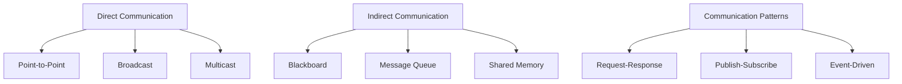
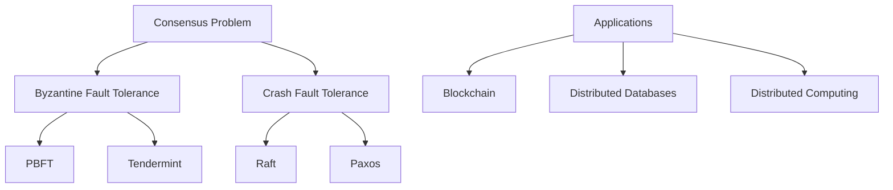

# 🤝 Multi-Agent Systems

## 📋 Overview

Multi-Agent Systems (MAS) involve multiple autonomous agents operating in a shared environment, requiring coordination, communication, and collaboration to achieve individual and collective goals. This section explores the architectures, protocols, and frameworks that enable effective multi-agent coordination.

## 🎯 Core Concepts

### Multi-Agent Systems
- **Definition**: Systems composed of multiple autonomous agents that interact to solve problems
- **Characteristics**: Distributed control, local information, asynchronous execution
- **Benefits**: Scalability, robustness, parallelism, modularity

### Agent Interactions
- **Cooperation**: Agents work together toward common goals
- **Competition**: Agents compete for limited resources
- **Coordination**: Agents synchronize actions to avoid conflicts
- **Negotiation**: Agents bargain to reach agreements

## 🏗️ MAS Architectures

| Architecture | Description | Advantages | Disadvantages | Use Cases |
|-------------|-------------|------------|---------------|-----------|
| **Hierarchical** | Tree-like command structure | Clear authority, efficient | Single point of failure | Military, corporate |
| **Heterarchical** | Flat, peer-to-peer structure | Flexible, robust | Complex coordination | Swarm robotics |
| **Federated** | Semi-autonomous groups | Balanced control | Moderate complexity | Cloud computing |
| **Market-based** | Economic mechanisms | Self-organizing | May not converge | Resource allocation |

## 🛠️ Open Source Frameworks

### Multi-Agent Development Platforms

| Framework | Language | Focus | Key Features | Repository |
|-----------|----------|-------|--------------|-----------|
| [JADE](https://jade.tilab.com/) | Java | FIPA compliance | Directory services, mobility | [GitHub](https://github.com/EmmanuelADAM/JadeUPHF) |
| [SPADE](https://spade-mas.readthedocs.io/) | Python | XMPP messaging | Real-time communication | [GitHub](https://github.com/javipalanca/spade) |
| [Mesa](https://mesa.readthedocs.io/) | Python | Agent-based modeling | Visualization, data collection | [GitHub](https://github.com/projectmesa/mesa) |
| [NetLogo](https://ccl.northwestern.edu/netlogo/) | NetLogo/Java | Educational modeling | Built-in visualization | [GitHub](https://github.com/NetLogo/NetLogo) |
| [SUMO](https://www.eclipse.org/sumo/) | C++/Python | Traffic simulation | Real-world applications | [GitHub](https://github.com/eclipse/sumo) |

### Specialized MAS Libraries

| Library | Focus | Language | Applications | Repository |
|---------|-------|----------|-------------|-----------|
| [PettingZoo](https://pettingzoo.farama.org/) | Multi-agent RL | Python | Game environments | [GitHub](https://github.com/Farama-Foundation/PettingZoo) |
| [MAgent](https://www.pettingzoo.ml/magent) | Large-scale simulation | Python/C++ | Swarm intelligence | [GitHub](https://github.com/geek-ai/MAgent) |
| [OpenSpiel](https://github.com/deepmind/open_spiel) | Game theory | C++/Python | Strategic games | [GitHub](https://github.com/deepmind/open_spiel) |
| [PyBullet](https://pybullet.org/) | Physics simulation | Python | Robotics | [GitHub](https://github.com/bulletphysics/bullet3) |

## 📡 Communication & Coordination

### Communication Models



### Coordination Mechanisms

| Mechanism | Approach | Complexity | Scalability | Examples |
|-----------|----------|------------|-------------|----------|
| **Contract Net** | Task announcement and bidding | Medium | Good | Task allocation |
| **Consensus** | Agreement on shared state | High | Limited | Blockchain, distributed systems |
| **Market Mechanisms** | Economic-based coordination | Medium | Excellent | Resource trading |
| **Voting** | Democratic decision making | Low | Good | Leader election |
| **Stigmergy** | Indirect coordination via environment | Low | Excellent | Ant colonies, swarm robotics |

### FIPA Standards

| Standard | Purpose | Implementation |
|----------|---------|----------------|
| **ACL** | Agent Communication Language | Message format |
| **AMS** | Agent Management System | Agent lifecycle |
| **DF** | Directory Facilitator | Service discovery |
| **Ontology** | Shared vocabulary | Semantic interoperability |

## 🎮 Game Theory & Strategic Behavior

### Game Types

| Game Type | Characteristics | Solution Concepts | Applications |
|-----------|----------------|-------------------|-------------|
| **Cooperative** | Binding agreements possible | Core, Shapley value | Coalition formation |
| **Non-cooperative** | No binding agreements | Nash equilibrium | Market competition |
| **Zero-sum** | One player's gain = other's loss | Minimax | Strategic games |
| **Non-zero-sum** | Mutual benefit possible | Pareto optimality | Collaboration |

### Nash Equilibrium Examples

```python
# Prisoner's Dilemma payoff matrix
#           Cooperate  Defect
# Cooperate    (3,3)   (0,5)
# Defect       (5,0)   (1,1)

class GameTheory:
    def __init__(self):
        self.payoff_matrix = {
            ('C', 'C'): (3, 3),
            ('C', 'D'): (0, 5),
            ('D', 'C'): (5, 0),
            ('D', 'D'): (1, 1)
        }
    
    def find_nash_equilibrium(self):
        # (Defect, Defect) is Nash equilibrium
        return ('D', 'D')
```

## 🧠 Learning in Multi-Agent Systems

### Multi-Agent Reinforcement Learning

| Algorithm | Approach | Assumptions | Complexity |
|-----------|----------|-------------|------------|
| **Independent Q-Learning** | Each agent learns independently | Stationary environment | Low |
| **Multi-Agent Q-Learning** | Considers other agents' actions | Full observability | High |
| **Policy Gradient Methods** | Direct policy optimization | Continuous action spaces | Medium |
| **Actor-Critic** | Combines value and policy methods | Partial observability | Medium |

### Learning Frameworks

| Framework | Focus | Features | Repository |
|-----------|-------|----------|-----------|
| [RLLib](https://docs.ray.io/en/latest/rllib/) | Scalable RL | Multi-agent support | [GitHub](https://github.com/ray-project/ray) |
| [MADDPG](https://github.com/openai/maddpg) | Continuous control | Actor-critic | [GitHub](https://github.com/openai/maddpg) |
| [PyMARL](https://github.com/oxwhirl/pymarl) | Multi-agent deep RL | StarCraft environments | [GitHub](https://github.com/oxwhirl/pymarl) |
| [SMAC](https://github.com/oxwhirl/smac) | StarCraft benchmark | Standard evaluation | [GitHub](https://github.com/oxwhirl/smac) |

## 🔄 Consensus & Agreement

### Consensus Algorithms



| Algorithm | Fault Model | Complexity | Network Assumptions |
|-----------|-------------|------------|-------------------|
| **Raft** | Crash faults | O(log n) | Asynchronous |
| **PBFT** | Byzantine faults | O(n²) | Partially synchronous |
| **Tendermint** | Byzantine faults | O(n²) | Partially synchronous |
| **HoneyBadgerBFT** | Byzantine faults | O(n log n) | Asynchronous |

### Distributed Consensus Libraries

| Library | Language | Algorithm | Repository |
|---------|----------|-----------|-----------|
| [Raft](https://raft.github.io/) | Multiple | Raft consensus | [raft.github.io](https://raft.github.io/) |
| [Tendermint](https://tendermint.com/) | Go | BFT consensus | [GitHub](https://github.com/tendermint/tendermint) |
| [etcd](https://etcd.io/) | Go | Raft-based | [GitHub](https://github.com/etcd-io/etcd) |
| [Consul](https://www.consul.io/) | Go | Raft-based | [GitHub](https://github.com/hashicorp/consul) |

## 🎯 Applications & Use Cases

### Robotics
- **Swarm Robotics**: Coordinated behavior of robot groups
- **Multi-Robot Systems**: Task allocation and path planning
- **Distributed Sensing**: Collaborative environment monitoring

### Finance
- **Algorithmic Trading**: Multi-agent market simulation
- **Risk Management**: Distributed risk assessment
- **Portfolio Management**: Collaborative investment strategies

### Smart Cities
- **Traffic Management**: Coordinated traffic light control
- **Energy Grid**: Distributed energy management
- **Emergency Response**: Coordinated emergency services

### Blockchain & Cryptocurrencies
- **Consensus Mechanisms**: Distributed agreement protocols
- **Smart Contracts**: Autonomous contract execution
- **Decentralized Finance**: Multi-agent financial protocols

## 📚 Learning Resources

### Free Courses

| Course | Provider | Focus | Duration | Link |
|--------|----------|-------|----------|------|
| Multi-Agent Systems | University of Edinburgh | MAS fundamentals | 6 weeks | [FutureLearn](https://www.futurelearn.com/courses/multi-agent-systems) |
| Game Theory | Stanford/Coursera | Strategic interactions | 8 weeks | [Coursera](https://www.coursera.org/learn/game-theory-1) |
| Distributed Systems | MIT OpenCourseWare | Distributed algorithms | Semester | [MIT 6.824](https://pdos.csail.mit.edu/6.824/) |

### Books & References
- **"Multiagent Systems: Algorithmic, Game-Theoretic, and Logical Foundations"** by Shoham & Leyton-Brown
- **"An Introduction to MultiAgent Systems"** by Michael Wooldridge
- **"Distributed Algorithms"** by Nancy Lynch

### Research Venues
- **AAMAS** (Autonomous Agents and Multi-Agent Systems)
- **IJCAI** (International Joint Conference on AI)
- **ICMAS** (International Conference on Multi-Agent Systems)

## 🧪 Practical Examples

### Simple Multi-Agent Environment

```python
import random
from enum import Enum

class AgentType(Enum):
    COOPERATIVE = 1
    COMPETITIVE = 2
    NEUTRAL = 3

class Agent:
    def __init__(self, agent_id, agent_type, position):
        self.id = agent_id
        self.type = agent_type
        self.position = position
        self.resources = 0
        self.neighbors = []
    
    def perceive(self, environment):
        # Sense nearby agents and resources
        return environment.get_local_state(self.position)
    
    def decide(self, percepts):
        if self.type == AgentType.COOPERATIVE:
            return self.cooperative_strategy(percepts)
        elif self.type == AgentType.COMPETITIVE:
            return self.competitive_strategy(percepts)
        else:
            return self.neutral_strategy(percepts)
    
    def cooperative_strategy(self, percepts):
        # Share information and resources
        return "share"
    
    def competitive_strategy(self, percepts):
        # Compete for resources
        return "compete"
    
    def neutral_strategy(self, percepts):
        # Random or balanced approach
        return random.choice(["share", "compete", "wait"])

class MultiAgentEnvironment:
    def __init__(self, width, height):
        self.width = width
        self.height = height
        self.agents = []
        self.resources = {}
    
    def add_agent(self, agent):
        self.agents.append(agent)
    
    def step(self):
        for agent in self.agents:
            percepts = agent.perceive(self)
            action = agent.decide(percepts)
            self.execute_action(agent, action)
    
    def execute_action(self, agent, action):
        # Execute agent action in environment
        pass
```

### Contract Net Protocol Implementation

```python
class ContractNetAgent:
    def __init__(self, agent_id, capabilities):
        self.id = agent_id
        self.capabilities = capabilities
        self.current_tasks = []
    
    def announce_task(self, task, agents):
        # Manager announces task
        proposals = []
        for agent in agents:
            if agent.can_perform(task):
                proposal = agent.submit_proposal(task)
                proposals.append((agent, proposal))
        
        # Select best proposal
        best_agent, best_proposal = min(proposals, 
                                      key=lambda x: x[1]['cost'])
        self.award_contract(best_agent, task)
    
    def submit_proposal(self, task):
        if self.can_perform(task):
            cost = self.calculate_cost(task)
            return {'cost': cost, 'deadline': self.estimate_deadline(task)}
        return None
    
    def can_perform(self, task):
        return task.required_capability in self.capabilities
    
    def calculate_cost(self, task):
        # Calculate cost based on current load and task complexity
        base_cost = task.complexity * 10
        load_factor = len(self.current_tasks) * 1.2
        return base_cost * load_factor
```

### Consensus Algorithm (Simplified Raft)

```python
import random
import time
from enum import Enum

class NodeState(Enum):
    FOLLOWER = 1
    CANDIDATE = 2
    LEADER = 3

class RaftNode:
    def __init__(self, node_id, cluster_size):
        self.id = node_id
        self.state = NodeState.FOLLOWER
        self.current_term = 0
        self.voted_for = None
        self.log = []
        self.cluster_size = cluster_size
        self.votes_received = 0
    
    def start_election(self):
        self.state = NodeState.CANDIDATE
        self.current_term += 1
        self.voted_for = self.id
        self.votes_received = 1  # Vote for self
        
        # Request votes from other nodes
        self.request_votes()
    
    def request_votes(self):
        # Send vote requests to other nodes
        # In real implementation, this would be network calls
        pass
    
    def receive_vote_request(self, candidate_term, candidate_id):
        if candidate_term > self.current_term:
            self.current_term = candidate_term
            self.voted_for = None
            self.state = NodeState.FOLLOWER
        
        if (candidate_term == self.current_term and 
            (self.voted_for is None or self.voted_for == candidate_id)):
            self.voted_for = candidate_id
            return True
        return False
    
    def receive_vote(self):
        self.votes_received += 1
        if self.votes_received > self.cluster_size // 2:
            self.become_leader()
    
    def become_leader(self):
        self.state = NodeState.LEADER
        # Start sending heartbeats
        self.send_heartbeats()
```

## 📊 Performance Metrics

### System-Level Metrics
- **Scalability**: Performance with increasing number of agents
- **Fault Tolerance**: Resilience to agent failures
- **Load Distribution**: Even distribution of work
- **Communication Overhead**: Message complexity

### Agent-Level Metrics
- **Individual Performance**: Agent success rate
- **Cooperation Level**: Degree of collaborative behavior
- **Adaptation Speed**: Response to environmental changes
- **Resource Utilization**: Efficiency in resource usage

### Coordination Metrics
- **Convergence Time**: Time to reach agreement
- **Consensus Quality**: Quality of collective decisions
- **Conflict Resolution**: Efficiency in handling conflicts
- **Emergent Behavior**: Quality of system-level behavior

## 🔗 Related Topics

- [Autonomy & Agency](./Autonomy-Agency.md)
- [Communication Protocols](../Architecture-Design/Communication-Protocols.md)
- [Decision Making & Planning](./Decision-Making-Planning.md)
- [Safety & Ethics](./Safety-Ethics.md)

---

*This document provides comprehensive coverage of multi-agent systems concepts, frameworks, and applications. For specific implementation details, refer to the framework documentation and practical examples provided.*