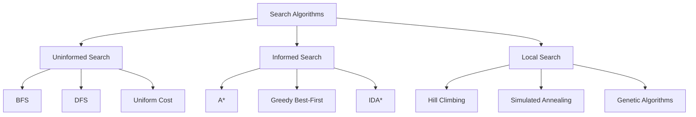
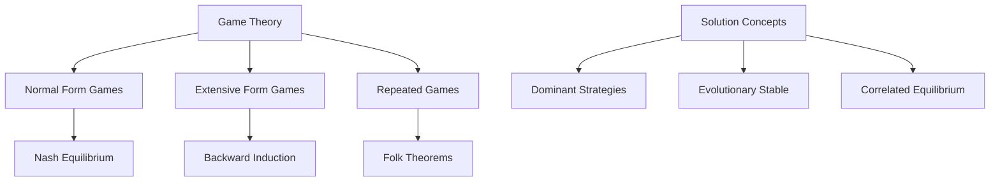

# 💡 Reasoning & Problem Solving

## 📋 Overview

Reasoning and problem solving are fundamental cognitive capabilities that enable AI agents to understand, analyze, and solve complex problems. This section covers logical reasoning, automated theorem proving, constraint satisfaction, and neural-symbolic approaches that form the intelligence backbone of autonomous agents.

## 🎯 Core Concepts

### Reasoning Types
- **Deductive**: Drawing specific conclusions from general principles
- **Inductive**: Generalizing from specific observations
- **Abductive**: Finding the best explanation for observations
- **Analogical**: Reasoning by similarity to known cases

### Problem Solving Paradigms
- **Search-based**: Exploring solution spaces systematically
- **Logic-based**: Using formal logical inference
- **Constraint-based**: Satisfying multiple constraints simultaneously
- **Neural-symbolic**: Combining neural networks with symbolic reasoning

## 🧠 Logical Reasoning Systems

### Logic Types & Applications

| Logic Type | Expressiveness | Decidability | Use Cases | Tools |
|------------|---------------|--------------|-----------|-------|
| **Propositional** | Boolean formulas | Decidable (NP-complete) | Simple reasoning | [PySAT](https://pysathq.github.io/) |
| **First-Order** | Predicates, quantifiers | Semi-decidable | Knowledge representation | [Vampire](https://vprover.github.io/) |
| **Description** | Concepts, roles | Various | Ontologies, semantic web | [Pellet](https://github.com/stardog-union/pellet) |
| **Modal** | Necessity, possibility | Various | Belief, knowledge reasoning | [LoTREC](http://www.irit.fr/~Martin.Dieguez/lotrec.html) |
| **Temporal** | Time-based properties | Various | Planning, verification | [TLV](http://www.cs.nyu.edu/acsys/tlv/) |

### Automated Theorem Provers

| Prover | Logic | Features | Repository |
|--------|-------|----------|-----------|
| [Lean](https://leanprover.github.io/) | Dependent types | Interactive, powerful | [GitHub](https://github.com/leanprover/lean4) |
| [Coq](https://coq.inria.fr/) | Dependent types | Proof assistant | [GitHub](https://github.com/coq/coq) |
| [Isabelle/HOL](https://isabelle.in.tum.de/) | Higher-order logic | Automated tools | [Website](https://isabelle.in.tum.de/) |
| [Vampire](https://vprover.github.io/) | First-order | Fast, competition winner | [GitHub](https://github.com/vprover/vampire) |
| [E Theorem Prover](https://wwwlehre.dhbw-stuttgart.de/~sschulz/E/E.html) | First-order | Equational reasoning | [Website](https://wwwlehre.dhbw-stuttgart.de/~sschulz/E/E.html) |

### SAT & SMT Solvers

| Solver | Type | Features | Repository |
|--------|------|----------|-----------|
| [Z3](https://github.com/Z3Prover/z3) | SMT | Multiple theories | [GitHub](https://github.com/Z3Prover/z3) |
| [CVC4](https://cvc4.github.io/) | SMT | Research-oriented | [GitHub](https://github.com/CVC4/CVC4) |
| [MiniSAT](http://minisat.se/) | SAT | Minimalist design | [Website](http://minisat.se/) |
| [Glucose](http://www.labri.fr/perso/lsimon/glucose/) | SAT | Competition winner | [Website](http://www.labri.fr/perso/lsimon/glucose/) |

## 🔍 Search Algorithms

### Classic Search Methods



| Algorithm | Optimality | Completeness | Space Complexity | Use Cases |
|-----------|------------|--------------|------------------|-----------|
| **Breadth-First Search** | Yes (unweighted) | Yes | O(b^d) | Shortest path |
| **Depth-First Search** | No | Yes (finite) | O(bm) | Tree traversal |
| **A*** | Yes | Yes | O(b^d) | Pathfinding |
| **Dijkstra** | Yes | Yes | O(b^d) | Weighted graphs |
| **IDA*** | Yes | Yes | O(bd) | Memory-limited |

### Advanced Search Techniques

| Technique | Purpose | Advantages | Applications |
|-----------|---------|------------|-------------|
| **Beam Search** | Limited exploration | Memory efficient | NLP, planning |
| **Monte Carlo Tree Search** | Probabilistic exploration | Handles uncertainty | Game AI, planning |
| **Iterative Deepening** | Memory-limited search | Space efficient | Deep searches |
| **Bidirectional Search** | Meet-in-the-middle | Faster convergence | Path planning |

## 🧩 Constraint Satisfaction

### CSP Components
- **Variables**: Decision variables to assign values
- **Domains**: Possible values for each variable
- **Constraints**: Restrictions on variable combinations

### CSP Algorithms

| Algorithm | Approach | Efficiency | Best For |
|-----------|----------|------------|----------|
| **Backtracking** | Systematic search | Exponential worst-case | Small problems |
| **Forward Checking** | Constraint propagation | Better pruning | Medium problems |
| **Arc Consistency** | Local consistency | Polynomial | Preprocessing |
| **Local Search** | Iterative improvement | Incomplete but fast | Large problems |

### CSP Libraries

| Library | Language | Features | Repository |
|---------|----------|----------|-----------|
| [OR-Tools](https://developers.google.com/optimization) | C++/Python | Google's solver | [GitHub](https://github.com/google/or-tools) |
| [Choco](https://choco-solver.org/) | Java | Open source | [GitHub](https://github.com/chocoteam/choco-solver) |
| [MiniZinc](https://www.minizinc.org/) | Modeling language | High-level modeling | [GitHub](https://github.com/MiniZinc/MiniZinc) |
| [OptaPlanner](https://www.optaplanner.org/) | Java | Business optimization | [GitHub](https://github.com/kiegroup/optaplanner) |
| [python-constraint](https://labix.org/python-constraint) | Python | Simple CSP solving | [PyPI](https://pypi.org/project/python-constraint/) |

## 🔗 Neural-Symbolic Integration

### Approaches to Neural-Symbolic AI

| Approach | Method | Advantages | Examples |
|----------|--------|------------|----------|
| **Symbolic-to-Neural** | Compile logic to networks | Interpretable | Neural Module Networks |
| **Neural-to-Symbolic** | Extract rules from networks | Explainable | Rule extraction |
| **Unified Architectures** | Joint learning | Best of both worlds | Graph Neural Networks |
| **Neuro-Symbolic Reasoning** | Neural guide symbolic | Efficient search | AlphaGeo, AlphaProof |

### Frameworks & Libraries

| Framework | Focus | Features | Repository |
|-----------|-------|----------|-----------|
| [PyTorch Geometric](https://pytorch-geometric.readthedocs.io/) | Graph neural networks | Graph reasoning | [GitHub](https://github.com/pyg-team/pytorch_geometric) |
| [DGL](https://www.dgl.ai/) | Deep graph library | Large-scale graphs | [GitHub](https://github.com/dmlc/dgl) |
| [Neural Logic](https://github.com/google/neural-logic-machines) | Logic machines | Differentiable reasoning | [GitHub](https://github.com/google/neural-logic-machines) |
| [ProbLog](https://dtai.cs.kuleuven.be/problog/) | Probabilistic logic | Uncertain reasoning | [Website](https://dtai.cs.kuleuven.be/problog/) |

## 🎮 Game Theory & Strategic Reasoning

### Game-Theoretic Concepts



### Strategic Reasoning Libraries

| Library | Focus | Features | Repository |
|---------|-------|----------|-----------|
| [Gambit](http://www.gambit-project.org/) | Game theory | Equilibrium computation | [GitHub](https://github.com/gambitproject/gambit) |
| [OpenSpiel](https://github.com/deepmind/open_spiel) | Games research | RL + game theory | [GitHub](https://github.com/deepmind/open_spiel) |
| [Nashpy](https://nashpy.readthedocs.io/) | Nash equilibria | Python implementation | [GitHub](https://github.com/drvinceknight/Nashpy) |
| [AxelrodPython](https://axelrod.readthedocs.io/) | Iterated prisoner's dilemma | Tournament simulation | [GitHub](https://github.com/Axelrod-Python/Axelrod) |

## 🔬 Advanced Reasoning Topics

### Probabilistic Reasoning

| Method | Type | Use Cases | Implementation |
|--------|------|-----------|----------------|
| **Bayesian Networks** | Graphical models | Causal reasoning | [pgmpy](https://github.com/pgmpy/pgmpy) |
| **Markov Logic Networks** | Statistical relational | Uncertain logic | [Alchemy](https://alchemy.cs.washington.edu/) |
| **Probabilistic Logic Programming** | Logic + probability | Knowledge representation | [ProbLog](https://dtai.cs.kuleuven.be/problog/) |
| **Fuzzy Logic** | Multi-valued logic | Approximate reasoning | [scikit-fuzzy](https://github.com/scikit-fuzzy/scikit-fuzzy) |

### Commonsense Reasoning

| Challenge | Approach | Examples | Resources |
|-----------|----------|----------|-----------|
| **Physical Reasoning** | Intuitive physics | Object dynamics | [Intuitive Physics Benchmark](https://github.com/cogtoolslab/physics-benchmarking-neurips2019) |
| **Social Reasoning** | Theory of mind | Intent recognition | [Theory of Mind Datasets](https://github.com/facebookresearch/CommonsenseQA) |
| **Causal Reasoning** | Causal inference | Cause-effect relationships | [DoWhy](https://github.com/microsoft/dowhy) |
| **Temporal Reasoning** | Time and events | Sequence understanding | [TimeBank](https://catalog.ldc.upenn.edu/LDC2006T08) |

## 🎯 Applications

### Automated Planning
- **Classical Planning**: STRIPS, PDDL domains
- **Temporal Planning**: Scheduling with time constraints
- **Hierarchical Planning**: Task decomposition
- **Probabilistic Planning**: Uncertainty handling

### Knowledge Representation
- **Ontologies**: Formal domain models
- **Semantic Web**: Linked data reasoning
- **Expert Systems**: Rule-based reasoning
- **Question Answering**: Knowledge-based QA

### Robotics
- **Motion Planning**: Path and trajectory planning
- **Task Planning**: High-level goal achievement
- **Perception**: Scene understanding and reasoning
- **Human-Robot Interaction**: Social reasoning

## 📚 Learning Resources

### Free Courses

| Course | Provider | Focus | Duration | Link |
|--------|----------|-------|----------|------|
| Logic & Computation | Carnegie Mellon | Logic foundations | Semester | [15-317](https://www.cs.cmu.edu/~fp/courses/317/) |
| Automated Reasoning | Delft University | Theorem proving | 8 weeks | [edX](https://www.edx.org/course/automated-reasoning) |
| Artificial Intelligence Planning | University of Edinburgh | AI planning | 6 weeks | [Coursera](https://www.coursera.org/learn/ai-planning) |
| Constraint Programming | Coursera | CSP solving | 4 weeks | [Coursera](https://www.coursera.org/learn/constraint-programming) |

### Books & References
- **"Artificial Intelligence: A Modern Approach"** by Russell & Norvig (Reasoning chapters)
- **"The Handbook of Knowledge Representation"** by van Harmelen, Lifschitz, and Porter
- **"Automated Reasoning"** by Wos, Overbeek, Lusk, and Boyle
- **"Constraint Satisfaction Problems"** by Tsang

### Research Venues
- **IJCAI** (International Joint Conference on AI)
- **AAAI** (Association for the Advancement of AI)
- **CADE** (Conference on Automated Deduction)
- **CP** (Principles and Practice of Constraint Programming)

## 🧪 Practical Examples

### Simple Logic Engine

```python
class LogicEngine:
    def __init__(self):
        self.facts = set()
        self.rules = []
    
    def add_fact(self, fact):
        self.facts.add(fact)
    
    def add_rule(self, premises, conclusion):
        self.rules.append((premises, conclusion))
    
    def infer(self):
        new_facts = set()
        
        for premises, conclusion in self.rules:
            if all(premise in self.facts for premise in premises):
                if conclusion not in self.facts:
                    new_facts.add(conclusion)
        
        if new_facts:
            self.facts.update(new_facts)
            return self.infer()  # Continue inference
        
        return self.facts

# Example usage
engine = LogicEngine()
engine.add_fact("socrates_is_human")
engine.add_fact("humans_are_mortal")
engine.add_rule(["socrates_is_human", "humans_are_mortal"], "socrates_is_mortal")

result = engine.infer()
print("Inferred facts:", result)
```

### CSP Solver Example

```python
class CSPSolver:
    def __init__(self, variables, domains, constraints):
        self.variables = variables
        self.domains = domains
        self.constraints = constraints
        self.assignment = {}
    
    def is_consistent(self, var, value):
        temp_assignment = self.assignment.copy()
        temp_assignment[var] = value
        
        for constraint in self.constraints:
            if not constraint(temp_assignment):
                return False
        return True
    
    def backtrack(self):
        if len(self.assignment) == len(self.variables):
            return self.assignment
        
        var = self.select_unassigned_variable()
        
        for value in self.domains[var]:
            if self.is_consistent(var, value):
                self.assignment[var] = value
                
                result = self.backtrack()
                if result is not None:
                    return result
                
                del self.assignment[var]
        
        return None
    
    def select_unassigned_variable(self):
        for var in self.variables:
            if var not in self.assignment:
                return var

# Example: Map coloring problem
def different_colors(assignment):
    for region1, region2 in [('WA', 'NT'), ('WA', 'SA'), ('NT', 'SA'), 
                           ('NT', 'Q'), ('SA', 'Q'), ('SA', 'NSW'), 
                           ('Q', 'NSW'), ('SA', 'V'), ('NSW', 'V')]:
        if region1 in assignment and region2 in assignment:
            if assignment[region1] == assignment[region2]:
                return False
    return True

variables = ['WA', 'NT', 'SA', 'Q', 'NSW', 'V', 'T']
domains = {var: ['red', 'green', 'blue'] for var in variables}
constraints = [different_colors]

solver = CSPSolver(variables, domains, constraints)
solution = solver.backtrack()
print("Map coloring solution:", solution)
```

### A* Search Implementation

```python
import heapq
from typing import List, Tuple, Callable

class AStarSearch:
    def __init__(self, graph: dict, heuristic: Callable):
        self.graph = graph
        self.heuristic = heuristic
    
    def search(self, start, goal) -> Tuple[List, float]:
        open_set = [(0, start, [])]  # (f_score, node, path)
        closed_set = set()
        g_scores = {start: 0}
        
        while open_set:
            current_f, current_node, path = heapq.heappop(open_set)
            
            if current_node == goal:
                return path + [current_node], g_scores[current_node]
            
            if current_node in closed_set:
                continue
            
            closed_set.add(current_node)
            
            for neighbor, cost in self.graph.get(current_node, []):
                tentative_g = g_scores[current_node] + cost
                
                if neighbor not in g_scores or tentative_g < g_scores[neighbor]:
                    g_scores[neighbor] = tentative_g
                    f_score = tentative_g + self.heuristic(neighbor, goal)
                    heapq.heappush(open_set, (f_score, neighbor, path + [current_node]))
        
        return None, float('inf')  # No path found

# Example usage
def manhattan_distance(node1, node2):
    x1, y1 = node1
    x2, y2 = node2
    return abs(x1 - x2) + abs(y1 - y2)

# Grid graph example
graph = {
    (0, 0): [((0, 1), 1), ((1, 0), 1)],
    (0, 1): [((0, 0), 1), ((0, 2), 1), ((1, 1), 1)],
    # ... more nodes
}

astar = AStarSearch(graph, manhattan_distance)
path, cost = astar.search((0, 0), (2, 2))
```

### Neural-Symbolic Reasoning

```python
import torch
import torch.nn as nn

class NeuralLogicModule(nn.Module):
    def __init__(self, input_size, hidden_size, num_predicates):
        super().__init__()
        self.encoder = nn.Sequential(
            nn.Linear(input_size, hidden_size),
            nn.ReLU(),
            nn.Linear(hidden_size, hidden_size),
            nn.ReLU()
        )
        
        self.predicate_heads = nn.ModuleList([
            nn.Linear(hidden_size, 1) for _ in range(num_predicates)
        ])
        
        self.logic_layer = LogicLayer()
    
    def forward(self, x, logic_rules):
        # Encode input to hidden representation
        hidden = self.encoder(x)
        
        # Compute predicate probabilities
        predicates = []
        for head in self.predicate_heads:
            pred_logit = head(hidden)
            pred_prob = torch.sigmoid(pred_logit)
            predicates.append(pred_prob)
        
        # Apply logic rules
        result = self.logic_layer(predicates, logic_rules)
        
        return result

class LogicLayer(nn.Module):
    def __init__(self):
        super().__init__()
    
    def forward(self, predicates, rules):
        # Implement differentiable logic operations
        # This is a simplified example
        results = []
        
        for rule in rules:
            if rule['type'] == 'and':
                result = predicates[rule['inputs'][0]]
                for i in rule['inputs'][1:]:
                    result = result * predicates[i]  # Fuzzy AND
            elif rule['type'] == 'or':
                result = predicates[rule['inputs'][0]]
                for i in rule['inputs'][1:]:
                    result = result + predicates[i] - result * predicates[i]  # Fuzzy OR
            
            results.append(result)
        
        return torch.stack(results)
```

## 📊 Performance Metrics

### Reasoning System Evaluation
- **Correctness**: Accuracy of inferences
- **Completeness**: Finding all valid conclusions
- **Soundness**: Avoiding invalid conclusions
- **Efficiency**: Time and space complexity

### Search Algorithm Metrics
- **Optimality**: Finding optimal solutions
- **Time Complexity**: Computational efficiency
- **Space Complexity**: Memory requirements
- **Completeness**: Guaranteed solution finding

### Knowledge Base Quality
- **Consistency**: No contradictions
- **Coverage**: Domain completeness
- **Precision**: Accurate facts and rules
- **Maintainability**: Easy updates and modifications

## 🔗 Related Topics

- [Decision Making & Planning](./Decision-Making-Planning.md)
- [Autonomy & Agency](./Autonomy-Agency.md)
- [Multi-Agent Systems](./Multi-Agent-Systems.md)
- [Agent Architectures](../Architecture-Design/Agent-Architectures.md)

---

*This document covers the essential concepts and tools for reasoning and problem solving in autonomous agents. For specific implementation guidance and advanced topics, refer to the framework documentation and research papers mentioned.*