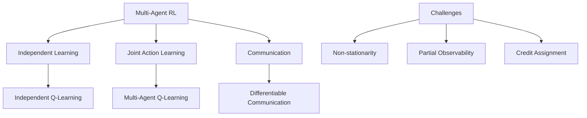

# 🎯 Reinforcement Learning

## 📋 Overview

Reinforcement Learning (RL) is a machine learning paradigm where agents learn optimal behavior through trial-and-error interactions with an environment. This section covers RL algorithms, frameworks, and applications essential for building adaptive autonomous agents.

## 🎯 Core Concepts

### Reinforcement Learning
- **Definition**: Learning optimal actions through rewards and penalties
- **Key Components**: Agent, environment, states, actions, rewards, policy
- **Goal**: Maximize cumulative reward over time

### Markov Decision Process (MDP)
- **States (S)**: All possible situations
- **Actions (A)**: Available choices in each state  
- **Rewards (R)**: Immediate feedback from environment
- **Transition Probabilities (P)**: State transition dynamics
- **Discount Factor (γ)**: Future reward importance

## 🛠️ RL Algorithms & Frameworks

### Value-Based Methods

| Algorithm | Type | Convergence | Use Cases | Implementation |
|-----------|------|-------------|-----------|----------------|
| **Q-Learning** | Off-policy | Guaranteed | Discrete actions | [Stable Baselines3](https://github.com/DLR-RM/stable-baselines3) |
| **SARSA** | On-policy | Guaranteed | Safe exploration | [RL-Toolkit](https://github.com/sfujim/RL-Toolkit) |
| **DQN** | Deep Q-Network | Approximate | High-dimensional states | [OpenAI Baselines](https://github.com/openai/baselines) |
| **Double DQN** | Improved DQN | Better stability | Overestimation issues | [Stable Baselines3](https://github.com/DLR-RM/stable-baselines3) |
| **Dueling DQN** | Architecture variant | Faster learning | Value/advantage separation | [TensorFlow Agents](https://github.com/tensorflow/agents) |

### Policy-Based Methods

| Algorithm | Type | Action Space | Advantages | Repository |
|-----------|------|-------------|------------|-----------|
| **REINFORCE** | Policy gradient | Continuous/Discrete | Simple, unbiased | [PyTorch RL](https://github.com/pytorch/rl) |
| **A2C** | Actor-Critic | Continuous/Discrete | Lower variance | [Stable Baselines3](https://github.com/DLR-RM/stable-baselines3) |
| **A3C** | Async Actor-Critic | Continuous/Discrete | Parallel training | [Universe Starter Agent](https://github.com/openai/universe-starter-agent) |
| **PPO** | Policy optimization | Continuous/Discrete | Stable training | [Stable Baselines3](https://github.com/DLR-RM/stable-baselines3) |
| **TRPO** | Trust region | Continuous/Discrete | Monotonic improvement | [TRPO Implementation](https://github.com/ikostrikov/pytorch-trpo) |

### Actor-Critic Methods

| Algorithm | Focus | Environment | Performance | Implementation |
|-----------|-------|-------------|-------------|----------------|
| **DDPG** | Continuous control | Deterministic | High sample efficiency | [Stable Baselines3](https://github.com/DLR-RM/stable-baselines3) |
| **TD3** | Improved DDPG | Continuous | Better stability | [TD3 PyTorch](https://github.com/sfujim/TD3) |
| **SAC** | Maximum entropy | Continuous | Sample efficient | [SAC Implementation](https://github.com/rail-berkeley/softlearning) |
| **IMPALA** | Distributed | Various | Scalable | [IMPALA](https://github.com/deepmind/scalable_agent) |

## 🧠 Deep Reinforcement Learning

### Neural Network Architectures

```mermaid
graph TD
    A[State Input] --> B[Feature Extraction]
    B --> C[Hidden Layers]
    C --> D{Architecture Type}
    
    D --> E[Value Network]
    D --> F[Policy Network]
    D --> G[Actor-Critic]
    
    E --> H[State Value V(s)]
    F --> I[Action Probabilities π(a|s)]
    G --> J[Both V(s) and π(a|s)]
```

### Key Innovations

| Innovation | Purpose | Impact | Examples |
|------------|---------|--------|----------|
| **Experience Replay** | Stable learning | Breaks correlation | DQN, DDPG |
| **Target Networks** | Stable targets | Reduces overestimation | DQN, TD3 |
| **Attention Mechanisms** | Focus on relevant features | Better performance | Decision Transformer |
| **Transformer Architecture** | Sequence modeling | State-of-the-art results | Decision Transformer |

## 🎮 RL Environments & Benchmarks

### Standard Environments

| Environment | Focus | Complexity | Actions | Repository |
|-------------|-------|------------|---------|-----------|
| [OpenAI Gym](https://gym.openai.com/) | General RL | Various | Discrete/Continuous | [GitHub](https://github.com/openai/gym) |
| [Atari Games](https://github.com/mgbellemare/Arcade-Learning-Environment) | Game AI | Medium | Discrete | [ALE](https://github.com/mgbellemare/Arcade-Learning-Environment) |
| [MuJoCo](https://mujoco.org/) | Robotics | High | Continuous | [mujoco-py](https://github.com/openai/mujoco-py) |
| [PyBullet](https://pybullet.org/) | Physics simulation | High | Continuous | [PyBullet](https://github.com/bulletphysics/bullet3) |
| [Unity ML-Agents](https://unity.com/products/machine-learning-agents) | 3D environments | Various | Both | [ML-Agents](https://github.com/Unity-Technologies/ml-agents) |

### Specialized Domains

| Domain | Environment | Challenge | Repository |
|--------|-------------|-----------|-----------|
| **Multi-Agent** | PettingZoo | Coordination | [GitHub](https://github.com/Farama-Foundation/PettingZoo) |
| **Robotics** | RoboSuite | Manipulation | [GitHub](https://github.com/ARISE-Initiative/robosuite) |
| **Trading** | FinRL | Financial markets | [GitHub](https://github.com/AI4Finance-Foundation/FinRL) |
| **Navigation** | Habitat | Spatial reasoning | [GitHub](https://github.com/facebookresearch/habitat-sim) |
| **Games** | OpenSpiel | Strategic thinking | [GitHub](https://github.com/deepmind/open_spiel) |

## 📚 Open Source Libraries & Frameworks

### Comprehensive Frameworks

| Framework | Language | Features | Focus | Repository |
|-----------|----------|----------|-------|-----------|
| [Stable Baselines3](https://stable-baselines3.readthedocs.io/) | Python | Production-ready algorithms | Ease of use | [GitHub](https://github.com/DLR-RM/stable-baselines3) |
| [RLLib](https://docs.ray.io/en/latest/rllib/) | Python | Distributed training | Scalability | [GitHub](https://github.com/ray-project/ray) |
| [TensorFlow Agents](https://www.tensorflow.org/agents) | Python | TensorFlow integration | Research | [GitHub](https://github.com/tensorflow/agents) |
| [Acme](https://github.com/deepmind/acme) | Python | Research-oriented | Modularity | [GitHub](https://github.com/deepmind/acme) |
| [CleanRL](https://cleanrl.dev/) | Python | Clean implementations | Learning | [GitHub](https://github.com/vwxyzjn/cleanrl) |

### Specialized Libraries

| Library | Focus | Use Case | Repository |
|---------|-------|----------|-----------|
| [Dopamine](https://github.com/google/dopamine) | Research | Quick prototyping | [GitHub](https://github.com/google/dopamine) |
| [PFRL](https://pfrl.readthedocs.io/) | PyTorch | Deep RL | [GitHub](https://github.com/pfnet/pfrl) |
| [Tianshou](https://tianshou.readthedocs.io/) | PyTorch | Modular design | [GitHub](https://github.com/thu-ml/tianshou) |
| [Garage](https://garage.readthedocs.io/) | Research | Reproducibility | [GitHub](https://github.com/rlworkgroup/garage) |

## 🔄 Advanced RL Topics

### Multi-Agent Reinforcement Learning



| Approach | Method | Advantages | Challenges |
|----------|--------|------------|------------|
| **Independent Learning** | Each agent learns separately | Simple, scalable | Non-stationary environment |
| **Centralized Training** | Global critic, local actors | Stable training | Scalability issues |
| **Communication** | Message passing between agents | Coordination | Communication overhead |
| **Emergent Communication** | Learn communication protocols | Adaptive | Interpretability |

### Hierarchical Reinforcement Learning

| Method | Approach | Benefits | Applications |
|--------|----------|----------|-------------|
| **Options Framework** | Temporal abstractions | Skill reuse | Navigation, robotics |
| **HAM** | Hierarchical state machines | Structured policies | Complex tasks |
| **MAXQ** | Value function decomposition | Sample efficiency | Planning domains |
| **FuN** | Feature control | Transfer learning | Atari, continuous control |

### Meta-Learning in RL

| Algorithm | Focus | Advantages | Repository |
|-----------|-------|------------|-----------|
| **MAML** | Few-shot adaptation | Fast learning | [GitHub](https://github.com/cbfinn/maml_rl) |
| **Reptile** | First-order MAML | Computational efficiency | [GitHub](https://github.com/openai/supervised-reptile) |
| **RL²** | Recurrent meta-learning | Memory-based adaptation | [RL² Implementation](https://github.com/DanielTakeshi/rl_squared) |

## 🎯 Applications

### Robotics
- **Manipulation**: Grasping, assembly, dexterous tasks
- **Navigation**: Path planning, obstacle avoidance
- **Locomotion**: Walking, running, dynamic movement

### Game AI
- **Strategy Games**: Chess, Go, StarCraft
- **Video Games**: NPCs, procedural content
- **Sports**: Team strategy, player modeling

### Finance
- **Algorithmic Trading**: Portfolio optimization
- **Risk Management**: Dynamic hedging
- **Market Making**: Bid-ask spread optimization

### Autonomous Systems
- **Self-Driving Cars**: Decision making, path planning
- **Drones**: Mission planning, obstacle avoidance
- **Smart Grids**: Energy management, load balancing

## 📚 Learning Resources

### Free Courses

| Course | Provider | Focus | Duration | Link |
|--------|----------|-------|----------|------|
| RL Course | David Silver | Fundamentals | 10 lectures | [UCL](https://www.davidsilver.uk/teaching/) |
| Deep RL | UC Berkeley | Deep learning + RL | Semester | [CS 285](http://rail.eecs.berkeley.edu/deeprlcourse/) |
| RL Specialization | Coursera | Practical RL | 4 courses | [Coursera](https://www.coursera.org/specializations/reinforcement-learning) |
| Spinning Up | OpenAI | Implementation | Self-paced | [SpinningUp](https://spinningup.openai.com/) |

### Books & References
- **"Reinforcement Learning: An Introduction"** by Sutton & Barto (free online)
- **"Deep Reinforcement Learning Hands-On"** by Maxim Lapan
- **"Algorithms for Reinforcement Learning"** by Csaba Szepesvári (free online)

### Research Papers & Surveys
- **"Human-level control through deep reinforcement learning"** (DQN) - Nature 2015
- **"Proximal Policy Optimization Algorithms"** (PPO) - arXiv 2017
- **"Soft Actor-Critic"** (SAC) - ICML 2018
- **"Deep Reinforcement Learning Survey"** - arXiv 2020

## 🧪 Practical Examples

### Q-Learning Implementation

```python
import numpy as np
import random

class QLearningAgent:
    def __init__(self, n_states, n_actions, learning_rate=0.1, 
                 discount_factor=0.95, epsilon=0.1):
        self.n_states = n_states
        self.n_actions = n_actions
        self.lr = learning_rate
        self.gamma = discount_factor
        self.epsilon = epsilon
        
        # Initialize Q-table
        self.q_table = np.zeros((n_states, n_actions))
    
    def get_action(self, state):
        # Epsilon-greedy action selection
        if random.random() < self.epsilon:
            return random.randint(0, self.n_actions - 1)
        else:
            return np.argmax(self.q_table[state])
    
    def update(self, state, action, reward, next_state, done):
        # Q-learning update rule
        current_q = self.q_table[state, action]
        
        if done:
            target_q = reward
        else:
            target_q = reward + self.gamma * np.max(self.q_table[next_state])
        
        # Update Q-value
        self.q_table[state, action] += self.lr * (target_q - current_q)
    
    def decay_epsilon(self, decay_rate=0.995):
        self.epsilon = max(0.01, self.epsilon * decay_rate)
```

### Policy Gradient (REINFORCE)

```python
import torch
import torch.nn as nn
import torch.optim as optim
import torch.nn.functional as F

class PolicyNetwork(nn.Module):
    def __init__(self, state_size, action_size, hidden_size=128):
        super(PolicyNetwork, self).__init__()
        self.fc1 = nn.Linear(state_size, hidden_size)
        self.fc2 = nn.Linear(hidden_size, hidden_size)
        self.fc3 = nn.Linear(hidden_size, action_size)
    
    def forward(self, x):
        x = F.relu(self.fc1(x))
        x = F.relu(self.fc2(x))
        x = F.softmax(self.fc3(x), dim=-1)
        return x

class REINFORCEAgent:
    def __init__(self, state_size, action_size, lr=0.001):
        self.policy_network = PolicyNetwork(state_size, action_size)
        self.optimizer = optim.Adam(self.policy_network.parameters(), lr=lr)
        
        self.log_probs = []
        self.rewards = []
    
    def get_action(self, state):
        state = torch.FloatTensor(state).unsqueeze(0)
        action_probs = self.policy_network(state)
        
        # Sample action from probability distribution
        action_dist = torch.distributions.Categorical(action_probs)
        action = action_dist.sample()
        
        # Store log probability for training
        self.log_probs.append(action_dist.log_prob(action))
        
        return action.item()
    
    def update(self, gamma=0.99):
        # Calculate discounted returns
        returns = []
        G = 0
        for reward in reversed(self.rewards):
            G = reward + gamma * G
            returns.insert(0, G)
        
        returns = torch.FloatTensor(returns)
        
        # Normalize returns (optional)
        returns = (returns - returns.mean()) / (returns.std() + 1e-8)
        
        # Calculate policy loss
        policy_loss = []
        for log_prob, G in zip(self.log_probs, returns):
            policy_loss.append(-log_prob * G)
        
        policy_loss = torch.stack(policy_loss).sum()
        
        # Update policy network
        self.optimizer.zero_grad()
        policy_loss.backward()
        self.optimizer.step()
        
        # Clear episode data
        self.log_probs = []
        self.rewards = []
```

### Actor-Critic Implementation

```python
class ActorCritic(nn.Module):
    def __init__(self, state_size, action_size, hidden_size=128):
        super(ActorCritic, self).__init__()
        
        # Shared layers
        self.shared = nn.Sequential(
            nn.Linear(state_size, hidden_size),
            nn.ReLU(),
            nn.Linear(hidden_size, hidden_size),
            nn.ReLU()
        )
        
        # Actor head (policy)
        self.actor = nn.Linear(hidden_size, action_size)
        
        # Critic head (value function)
        self.critic = nn.Linear(hidden_size, 1)
    
    def forward(self, state):
        shared_features = self.shared(state)
        
        # Policy output
        action_logits = self.actor(shared_features)
        action_probs = F.softmax(action_logits, dim=-1)
        
        # Value output
        state_value = self.critic(shared_features)
        
        return action_probs, state_value

class A2CAgent:
    def __init__(self, state_size, action_size, lr=0.001):
        self.ac_network = ActorCritic(state_size, action_size)
        self.optimizer = optim.Adam(self.ac_network.parameters(), lr=lr)
    
    def get_action(self, state):
        state = torch.FloatTensor(state).unsqueeze(0)
        action_probs, state_value = self.ac_network(state)
        
        action_dist = torch.distributions.Categorical(action_probs)
        action = action_dist.sample()
        
        return action.item(), action_dist.log_prob(action), state_value
    
    def update(self, states, actions, rewards, next_states, dones, gamma=0.99):
        states = torch.FloatTensor(states)
        actions = torch.LongTensor(actions)
        rewards = torch.FloatTensor(rewards)
        next_states = torch.FloatTensor(next_states)
        dones = torch.BoolTensor(dones)
        
        # Calculate returns and advantages
        _, next_values = self.ac_network(next_states)
        returns = rewards + gamma * next_values.squeeze() * (~dones)
        
        action_probs, values = self.ac_network(states)
        advantages = returns - values.squeeze()
        
        # Actor loss (policy gradient)
        action_dist = torch.distributions.Categorical(action_probs)
        log_probs = action_dist.log_prob(actions)
        actor_loss = -(log_probs * advantages.detach()).mean()
        
        # Critic loss (value function)
        critic_loss = F.mse_loss(values.squeeze(), returns)
        
        # Total loss
        total_loss = actor_loss + 0.5 * critic_loss
        
        # Update network
        self.optimizer.zero_grad()
        total_loss.backward()
        self.optimizer.step()
```

## 📊 Performance Evaluation

### Key Metrics
- **Cumulative Reward**: Total reward over episode
- **Sample Efficiency**: Learning speed (samples to convergence)
- **Stability**: Variance in performance
- **Generalization**: Performance on unseen environments

### Benchmark Results
| Algorithm | Atari (Human-normalized) | MuJoCo (Average Return) | Training Time |
|-----------|-------------------------|-------------------------|---------------|
| **DQN** | 121.9% | N/A | Medium |
| **Rainbow** | 223.7% | N/A | High |
| **PPO** | N/A | Variable | Medium |
| **SAC** | N/A | State-of-the-art | Medium |

## 🔗 Related Topics

- [Decision Making & Planning](./Decision-Making-Planning.md)
- [Multi-Agent Systems](./Multi-Agent-Systems.md)
- [Autonomy & Agency](./Autonomy-Agency.md)
- [Agent Architectures](../Architecture-Design/Agent-Architectures.md)

---

*This document provides comprehensive coverage of reinforcement learning for autonomous agents. For specific implementation details and advanced topics, refer to the framework documentation and research papers mentioned.*