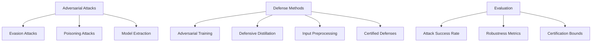
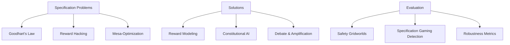

# 🛡️ Safety & Ethics

## 📋 Overview

AI Safety and Ethics are critical considerations for developing responsible autonomous agents. This section covers safety frameworks, alignment techniques, ethical guidelines, and practical approaches to ensure AI systems operate safely and beneficially in real-world environments.

## 🎯 Core Concepts

### AI Safety
- **Definition**: Ensuring AI systems operate as intended without causing harm
- **Scope**: Technical safety, robustness, reliability, and controllability
- **Challenges**: Specification gaming, reward hacking, distributional shift

### AI Alignment
- **Value Alignment**: Ensuring AI goals match human values
- **Intent Alignment**: AI understands and follows human intentions
- **Impact Alignment**: AI actions produce intended consequences

### AI Ethics
- **Fairness**: Avoiding bias and discrimination
- **Transparency**: Explainable and interpretable decisions
- **Accountability**: Clear responsibility for AI actions
- **Privacy**: Protecting personal data and information

## 🛡️ Safety Frameworks & Approaches

### Technical Safety Methods

| Approach | Purpose | Techniques | Maturity | Applications |
|----------|---------|------------|----------|-------------|
| **Robustness Testing** | Handle edge cases | Adversarial testing, stress testing | High | All domains |
| **Formal Verification** | Mathematical guarantees | Model checking, theorem proving | Medium | Critical systems |
| **Safe Exploration** | Learn without harm | Conservative policies, safe spaces | Medium | Robotics, autonomous vehicles |
| **Interpretability** | Understand decisions | Attention, gradients, LIME/SHAP | Medium | Healthcare, finance |
| **Uncertainty Quantification** | Know what you don't know | Bayesian methods, ensembles | Medium | Decision making |

### Safety Research Organizations

| Organization | Focus | Resources | Repository/Website |
|-------------|-------|-----------|-------------------|
| [Anthropic](https://www.anthropic.com/) | Constitutional AI | Research papers | [Website](https://www.anthropic.com/) |
| [OpenAI Safety](https://openai.com/safety/) | GPT safety research | Safety guidelines | [Website](https://openai.com/safety/) |
| [MIRI](https://intelligence.org/) | AI alignment theory | Research publications | [Website](https://intelligence.org/) |
| [Center for AI Safety](https://www.safe.ai/) | Extinction risk | Public advocacy | [Website](https://www.safe.ai/) |
| [Future of Humanity Institute](https://www.fhi.ox.ac.uk/) | Existential risk | Academic research | [Website](https://www.fhi.ox.ac.uk/) |

## 🔒 Robustness & Reliability

### Adversarial Robustness



### Robustness Libraries & Tools

| Library | Focus | Features | Repository |
|---------|-------|----------|-----------|
| [Adversarial Robustness Toolbox](https://adversarial-robustness-toolbox.readthedocs.io/) | Comprehensive defense | Multiple frameworks | [GitHub](https://github.com/Trusted-AI/adversarial-robustness-toolbox) |
| [CleverHans](https://cleverhans.readthedocs.io/) | Adversarial examples | Attack methods | [GitHub](https://github.com/cleverhans-lab/cleverhans) |
| [Foolbox](https://foolbox.readthedocs.io/) | Adversarial attacks | Framework agnostic | [GitHub](https://github.com/bethgelab/foolbox) |
| [TextAttack](https://textattack.readthedocs.io/) | NLP adversarial | Text-specific attacks | [GitHub](https://github.com/QData/TextAttack) |
| [RobustBench](https://robustbench.github.io/) | Standardized evaluation | Leaderboards | [GitHub](https://github.com/RobustBench/robustbench) |

### Uncertainty Quantification

| Method | Type | Advantages | Use Cases | Implementation |
|--------|------|------------|-----------|----------------|
| **Bayesian Neural Networks** | Epistemic | Principled uncertainty | Critical decisions | [Pyro](https://github.com/pyro-ppl/pyro) |
| **Monte Carlo Dropout** | Epistemic | Simple implementation | General purpose | [Custom implementation](https://github.com/yaringal/DropoutUncertaintyExps) |
| **Deep Ensembles** | Both | Good empirical results | Production systems | [TensorFlow](https://www.tensorflow.org/tutorials/understanding/sngp) |
| **Conformal Prediction** | Coverage | Distribution-free | Prediction intervals | [MAPIE](https://github.com/scikit-learn-contrib/MAPIE) |

## 🎯 AI Alignment Approaches

### Value Learning & Specification

| Approach | Method | Advantages | Challenges | Research |
|----------|--------|------------|------------|----------|
| **Inverse Reinforcement Learning** | Learn from demonstrations | Natural specification | Demonstration quality | [IRL Algorithms](https://github.com/MatthewJA/Inverse-Reinforcement-Learning) |
| **Cooperative Inverse RL** | Human-AI collaboration | Active learning | Human burden | [Research Papers](https://arxiv.org/abs/1606.03137) |
| **Constitutional AI** | Self-improvement via principles | Scalable supervision | Principle specification | [Anthropic Research](https://www.anthropic.com/index/constitutional-ai-harmlessness-from-ai-feedback) |
| **Recursive Reward Modeling** | Hierarchical reward learning | Scalability | Complexity management | [OpenAI Research](https://openai.com/research/scalable-agent-alignment-via-reward-modeling) |

### Alignment Research Tools

| Tool | Purpose | Features | Repository |
|------|---------|----------|-----------|
| [AI Safety Gridworlds](https://github.com/deepmind/ai-safety-gridworlds) | Safety evaluation | Standard environments | [GitHub](https://github.com/deepmind/ai-safety-gridworlds) |
| [Procgen](https://github.com/openai/procgen) | Generalization testing | Procedural environments | [GitHub](https://github.com/openai/procgen) |
| [IRL Benchmark](https://github.com/HumanCompatibleAI/imitation) | Imitation learning | Benchmark suite | [GitHub](https://github.com/HumanCompatibleAI/imitation) |
| [Mesa-Safety](https://github.com/projectmesa/mesa) | Multi-agent safety | Simulation framework | [GitHub](https://github.com/projectmesa/mesa) |

## ⚖️ Ethics & Fairness

### Fairness Metrics & Definitions

| Metric | Definition | Use Case | Limitations |
|--------|------------|----------|-------------|
| **Demographic Parity** | Equal positive rates across groups | Screening processes | May reduce accuracy |
| **Equalized Odds** | Equal TPR and FPR across groups | Binary classification | Requires sensitive attributes |
| **Calibration** | Predicted probabilities match outcomes | Risk assessment | May allow discrimination |
| **Individual Fairness** | Similar individuals treated similarly | Personalized systems | Requires similarity metric |

### Fairness & Bias Libraries

| Library | Focus | Features | Repository |
|---------|-------|----------|-----------|
| [Fairlearn](https://fairlearn.org/) | ML fairness | Bias detection, mitigation | [GitHub](https://github.com/fairlearn/fairlearn) |
| [AI Fairness 360](https://aif360.mybluemix.net/) | Comprehensive toolkit | Multiple algorithms | [GitHub](https://github.com/Trusted-AI/AIF360) |
| [What-If Tool](https://pair-code.github.io/what-if-tool/) | Model understanding | Interactive analysis | [GitHub](https://github.com/PAIR-code/what-if-tool) |
| [Themis](https://github.com/LASER-UMASS/Themis) | Discrimination testing | Automated testing | [GitHub](https://github.com/LASER-UMASS/Themis) |
| [Aequitas](http://aequitas.dssg.io/) | Bias audit | Model auditing | [GitHub](https://github.com/dssg/aequitas) |

### Explainable AI (XAI)

| Method | Type | Model Agnostic | Strengths | Repository |
|--------|------|---------------|-----------|-----------|
| **LIME** | Local | Yes | Intuitive explanations | [GitHub](https://github.com/marcotcr/lime) |
| **SHAP** | Local/Global | Yes | Unified framework | [GitHub](https://github.com/slundberg/shap) |
| **Grad-CAM** | Visual | No | Visual interpretability | [GitHub](https://github.com/jacobgil/pytorch-grad-cam) |
| **Integrated Gradients** | Attribution | No | Theoretical guarantees | [Captum](https://github.com/pytorch/captum) |
| **Counterfactual Explanations** | Contrastive | Yes | Actionable insights | [DiCE](https://github.com/interpretml/DiCE) |

## 🏛️ Governance & Regulation

### AI Governance Frameworks

| Framework | Scope | Key Principles | Status |
|-----------|-------|----------------|--------|
| **EU AI Act** | European Union | Risk-based approach | Enacted 2024 |
| **NIST AI RMF** | United States | Risk management | Published 2023 |
| **IEEE Standards** | International | Technical standards | Ongoing |
| **ISO/IEC 23053** | International | AI risk management | Draft |
| **Partnership on AI** | Industry | Best practices | Active |

### Compliance & Auditing Tools

| Tool | Purpose | Features | Repository |
|------|---------|----------|-----------|
| [AI Fairness 360](https://aif360.mybluemix.net/) | Bias auditing | Comprehensive metrics | [GitHub](https://github.com/Trusted-AI/AIF360) |
| [Responsible AI Toolbox](https://responsibleaitoolbox.ai/) | Model assessment | Multiple perspectives | [GitHub](https://github.com/microsoft/responsible-ai-toolbox) |
| [Model Cards](https://modelcards.withgoogle.com/) | Documentation | Transparency | [GitHub](https://github.com/tensorflow/model-card-toolkit) |
| [Datasheets for Datasets](https://arxiv.org/abs/1803.09010) | Data documentation | Dataset transparency | [Template](https://github.com/microsoft/DatasheetForDatasets) |

## 🔬 Safety Research Areas

### Specification & Reward Design



### Emerging Safety Challenges

| Challenge | Description | Research Status | Key Papers |
|-----------|-------------|----------------|------------|
| **Mesa-Optimization** | Learned optimizers with different objectives | Early research | [Risks from Learned Optimization](https://arxiv.org/abs/1906.01820) |
| **Deceptive Alignment** | AI appearing aligned during training | Theoretical | [Deceptive Alignment](https://arxiv.org/abs/1906.01820) |
| **Distributional Shift** | Performance degradation on new data | Active research | [Distributionally Robust Learning](https://arxiv.org/abs/1911.08731) |
| **Emergent Capabilities** | Unexpected behaviors in large models | Growing concern | [Emergent Abilities](https://arxiv.org/abs/2206.07682) |

## 🎯 Practical Safety Implementation

### Safety-Critical System Design

| Principle | Implementation | Examples | Tools |
|-----------|----------------|----------|-------|
| **Defense in Depth** | Multiple safety layers | Autonomous vehicles | System design patterns |
| **Fail-Safe Defaults** | Safe states on failure | Medical devices | Formal verification |
| **Redundancy** | Backup systems | Aviation | Consensus algorithms |
| **Human Oversight** | Meaningful human control | Military applications | Human-in-the-loop systems |

### Safety Testing Methodologies

| Method | Purpose | When to Use | Implementation |
|--------|---------|-------------|----------------|
| **Stress Testing** | Find breaking points | Before deployment | Extreme input testing |
| **Red Team Exercises** | Adversarial evaluation | Security assessment | Organized attack simulation |
| **Formal Verification** | Mathematical proofs | Critical systems | Model checking tools |
| **Penetration Testing** | Security vulnerabilities | System security | Automated tools + manual |

## 📚 Learning Resources

### Free Courses & Materials

| Resource | Provider | Focus | Duration | Link |
|----------|----------|-------|----------|------|
| AI Safety Fundamentals | BlueDot Impact | Safety overview | 8 weeks | [AI Safety Fundamentals](https://aisafetyfundamentals.com/) |
| Ethics in AI | MIT OpenCourseWare | Ethics foundations | Semester | [MIT 6.S192](https://ocw.mit.edu/courses/6-s192-making-ai-systems-safer-spring-2019/) |
| Fairness in ML | Coursera | Bias and fairness | 4 weeks | [Coursera](https://www.coursera.org/learn/fairness-accountability-transparency-privacy) |
| Explainable AI | edX | XAI methods | 6 weeks | [edX](https://www.edx.org/course/explainable-artificial-intelligence) |

### Key Books & Papers
- **"Human Compatible"** by Stuart Russell
- **"Weapons of Math Destruction"** by Cathy O'Neil  
- **"Race After Technology"** by Ruha Benjamin
- **"Concrete Problems in AI Safety"** - Amodei et al. (2016)
- **"AI Alignment: Why It's Hard, and Where to Start"** - Yudkowsky (2016)

### Research Communities
- [AI Alignment Forum](https://www.alignmentforum.org/)
- [LessWrong](https://www.lesswrong.com/)
- [EA Forum](https://forum.effectivealtruism.org/)
- [Partnership on AI](https://partnershiponai.org/)

## 🧪 Practical Examples

### Safe Reinforcement Learning

```python
import numpy as np
import torch
import torch.nn as nn

class SafeRLAgent:
    def __init__(self, state_dim, action_dim, safety_threshold=0.1):
        self.safety_threshold = safety_threshold
        self.policy_net = PolicyNetwork(state_dim, action_dim)
        self.safety_critic = SafetyCritic(state_dim, action_dim)
        self.value_critic = ValueCritic(state_dim)
        
    def select_action(self, state):
        # Get action from policy
        action_dist = self.policy_net(state)
        action = action_dist.sample()
        
        # Check safety constraint
        safety_value = self.safety_critic(state, action)
        
        if safety_value < self.safety_threshold:
            # Fall back to safe action
            action = self.get_safe_action(state)
        
        return action
    
    def get_safe_action(self, state):
        # Conservative action selection
        # Could use domain knowledge or learned safe policy
        return torch.zeros(self.action_dim)  # Simplified: do nothing
    
    def update_safety_critic(self, experiences):
        # Update safety critic based on safety violations
        for state, action, safety_cost, next_state in experiences:
            predicted_cost = self.safety_critic(state, action)
            target_cost = safety_cost + self.gamma * self.safety_critic(next_state, self.get_safe_action(next_state))
            loss = nn.MSELoss()(predicted_cost, target_cost)
            # Update safety critic...

class SafetyCritic(nn.Module):
    def __init__(self, state_dim, action_dim):
        super().__init__()
        self.network = nn.Sequential(
            nn.Linear(state_dim + action_dim, 128),
            nn.ReLU(),
            nn.Linear(128, 128),
            nn.ReLU(),
            nn.Linear(128, 1)  # Output safety cost
        )
    
    def forward(self, state, action):
        x = torch.cat([state, action], dim=-1)
        return self.network(x)
```

### Bias Detection & Mitigation

```python
import pandas as pd
import numpy as np
from sklearn.metrics import confusion_matrix

class FairnessAuditor:
    def __init__(self, protected_attributes):
        self.protected_attributes = protected_attributes
    
    def demographic_parity(self, y_pred, protected_attr):
        """Check if positive prediction rates are equal across groups"""
        groups = np.unique(protected_attr)
        rates = {}
        
        for group in groups:
            group_mask = protected_attr == group
            positive_rate = np.mean(y_pred[group_mask])
            rates[group] = positive_rate
        
        # Calculate max difference
        max_diff = max(rates.values()) - min(rates.values())
        
        return rates, max_diff
    
    def equalized_odds(self, y_true, y_pred, protected_attr):
        """Check if TPR and FPR are equal across groups"""
        groups = np.unique(protected_attr)
        metrics = {}
        
        for group in groups:
            group_mask = protected_attr == group
            tn, fp, fn, tp = confusion_matrix(
                y_true[group_mask], y_pred[group_mask]
            ).ravel()
            
            tpr = tp / (tp + fn) if (tp + fn) > 0 else 0
            fpr = fp / (fp + tn) if (fp + tn) > 0 else 0
            
            metrics[group] = {'tpr': tpr, 'fpr': fpr}
        
        return metrics
    
    def individual_fairness_lipschitz(self, model, X, similarity_func, 
                                    epsilon=0.1):
        """Check Lipschitz condition for individual fairness"""
        violations = []
        
        for i in range(len(X)):
            for j in range(i+1, len(X)):
                x_i, x_j = X[i], X[j]
                
                # Calculate similarity
                similarity = similarity_func(x_i, x_j)
                
                # Get model predictions
                pred_i = model.predict([x_i])[0]
                pred_j = model.predict([x_j])[0]
                
                # Check Lipschitz condition
                pred_diff = abs(pred_i - pred_j)
                
                if pred_diff > epsilon * similarity:
                    violations.append((i, j, pred_diff, similarity))
        
        return violations

# Usage example
def euclidean_similarity(x1, x2):
    return 1 / (1 + np.linalg.norm(x1 - x2))

auditor = FairnessAuditor(['gender', 'race'])
dp_rates, dp_diff = auditor.demographic_parity(predictions, gender_attr)
eo_metrics = auditor.equalized_odds(true_labels, predictions, race_attr)
```

### Constitutional AI Implementation

```python
class ConstitutionalAI:
    def __init__(self, base_model, constitution):
        self.base_model = base_model
        self.constitution = constitution  # List of principles
        self.critique_model = self.train_critique_model()
        
    def generate_with_constitution(self, prompt, max_iterations=3):
        response = self.base_model.generate(prompt)
        
        for iteration in range(max_iterations):
            # Critique the response against constitution
            critiques = self.critique_response(response)
            
            if not critiques:  # No violations found
                break
            
            # Revise response based on critiques
            revision_prompt = self.create_revision_prompt(
                prompt, response, critiques
            )
            response = self.base_model.generate(revision_prompt)
        
        return response
    
    def critique_response(self, response):
        critiques = []
        
        for principle in self.constitution:
            violation = self.check_principle_violation(response, principle)
            if violation:
                critiques.append({
                    'principle': principle,
                    'violation': violation,
                    'suggestion': self.suggest_improvement(response, principle)
                })
        
        return critiques
    
    def check_principle_violation(self, response, principle):
        # Use critique model to check if response violates principle
        critique_prompt = f"""
        Principle: {principle['description']}
        Response: {response}
        
        Does this response violate the principle? Explain why.
        """
        
        critique = self.critique_model.generate(critique_prompt)
        
        # Parse critique to determine if violation occurred
        if "violates" in critique.lower() or "violation" in critique.lower():
            return critique
        
        return None
    
    def train_critique_model(self):
        # Train or load a model specifically for critiquing responses
        # This could be fine-tuned on constitutional principles
        pass
    
    def create_revision_prompt(self, original_prompt, response, critiques):
        critique_text = "\n".join([
            f"Issue: {c['violation']}\nSuggestion: {c['suggestion']}"
            for c in critiques
        ])
        
        revision_prompt = f"""
        Original request: {original_prompt}
        Previous response: {response}
        
        Issues identified:
        {critique_text}
        
        Please provide a revised response that addresses these issues:
        """
        
        return revision_prompt

# Example constitution
constitution = [
    {
        'name': 'helpfulness',
        'description': 'Be helpful and provide useful information'
    },
    {
        'name': 'harmlessness', 
        'description': 'Avoid harmful, illegal, or unethical content'
    },
    {
        'name': 'honesty',
        'description': 'Be truthful and acknowledge uncertainty'
    }
]
```

## 📊 Safety Metrics & Evaluation

### Key Safety Metrics

| Metric | Purpose | Calculation | Interpretation |
|--------|---------|-------------|----------------|
| **Robustness** | Adversarial resistance | Accuracy under attack | Higher is better |
| **Calibration** | Confidence reliability | Expected vs actual accuracy | Closer to diagonal is better |
| **Coverage** | Uncertainty quantification | Prediction interval coverage | Should match confidence level |
| **Fairness Gap** | Bias measurement | Max difference across groups | Lower is better |

### Safety Evaluation Frameworks

| Framework | Focus | Metrics | Repository |
|-----------|-------|---------|-----------|
| [HELM](https://crfm.stanford.edu/helm/) | Language model evaluation | Comprehensive benchmarks | [GitHub](https://github.com/stanford-crfm/helm) |
| [AI Safety Gym](https://openai.com/safety-gym/) | Safe RL evaluation | Constraint violations | [GitHub](https://github.com/openai/safety-gym) |
| [Trustworthy ML](https://www.trustworthyml.org/) | ML reliability | Multiple dimensions | [Website](https://www.trustworthyml.org/) |

## 🔗 Related Topics

- [Autonomy & Agency](./Autonomy-Agency.md) - Responsible autonomy
- [Multi-Agent Systems](./Multi-Agent-Systems.md) - Coordination ethics
- [Decision Making & Planning](./Decision-Making-Planning.md) - Safe planning
- [Agent Evaluation](../Agent-Evaluation-Benchmarking/Evaluation-Frameworks.md) - Safety testing

---

*This document provides comprehensive coverage of AI safety and ethics for autonomous agents. For specific implementation guidance and the latest research, refer to the resources and repositories mentioned throughout this guide.*