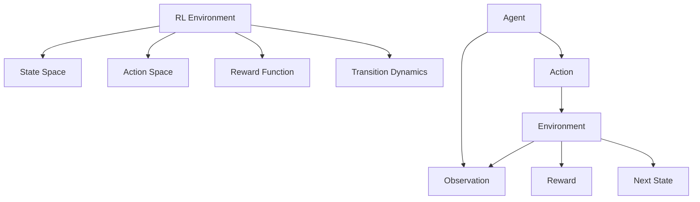
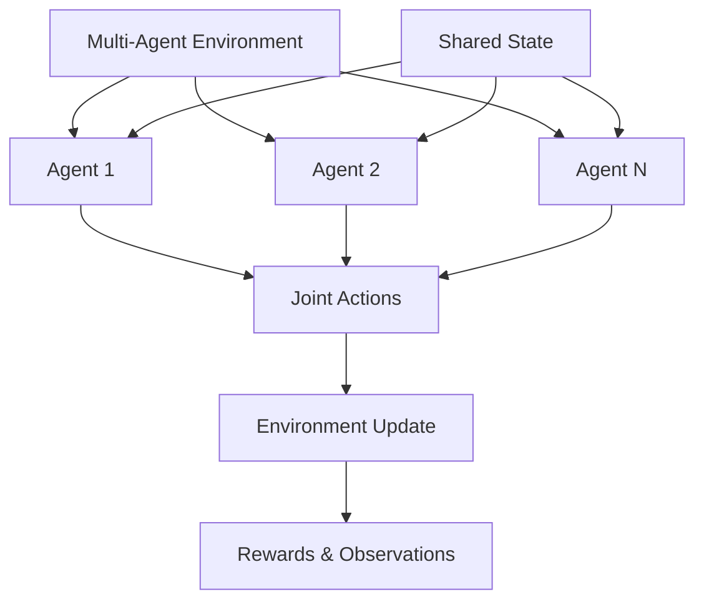
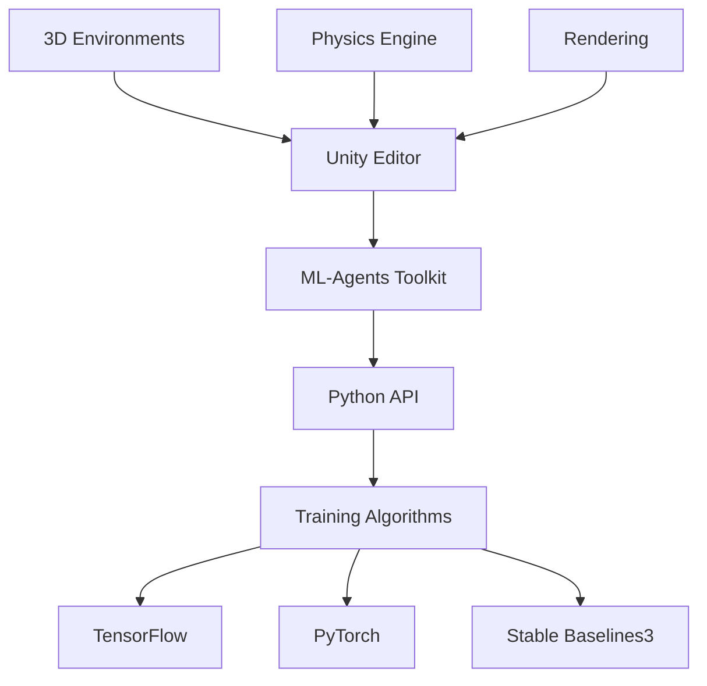
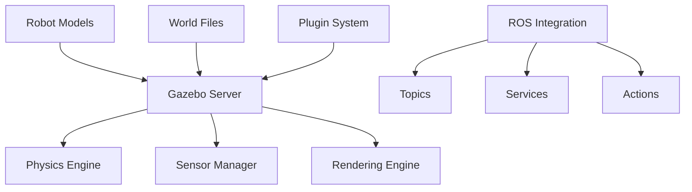
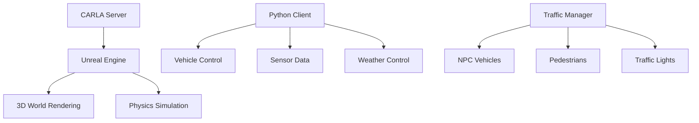

# 🎮 Simulation Environments

## 📋 Overview

Simulation environments provide controlled, reproducible settings for developing, training, and testing autonomous agents. This section covers open-source simulation platforms, benchmark environments, and tools that enable safe and efficient agent development across various domains.

## 🎯 Core Environment Types

### 1. Reinforcement Learning Environments



### 2. Multi-Agent Environments



## 🏗️ Major Simulation Platforms

### OpenAI Gym & Gymnasium

| Feature | Description | Use Cases | Repository |
|---------|-------------|-----------|-----------|
| **Standard Interface** | Unified API for RL environments | Algorithm development | [Gymnasium](https://github.com/Farama-Foundation/Gymnasium) |
| **Environment Registry** | Large collection of environments | Benchmarking | [Gym Environments](https://gymnasium.farama.org/environments/) |
| **Custom Environments** | Easy environment creation | Research projects | [Custom Envs Guide](https://gymnasium.farama.org/tutorials/environment_creation/) |

#### Popular Gym Environments

| Environment | Domain | Complexity | Features |
|-------------|--------|------------|----------|
| **CartPole** | Control | Simple | Continuous state, discrete action |
| **Atari Games** | Games | Medium | Image observations, discrete actions |
| **MuJoCo** | Robotics | High | Physics simulation, continuous control |
| **Box2D** | Physics | Medium | 2D physics, various tasks |

### Unity ML-Agents



| Component | Purpose | Features | Repository |
|-----------|---------|----------|-----------|
| **Unity Engine** | 3D environment creation | Visual scripting, physics | [ML-Agents](https://github.com/Unity-Technologies/ml-agents) |
| **Python Trainers** | RL algorithm implementation | PPO, SAC, Curiosity | [ML-Agents Trainers](https://github.com/Unity-Technologies/ml-agents/tree/main/ml-agents) |
| **Communicator** | Unity-Python bridge | TCP/side-channel communication | [Python API](https://github.com/Unity-Technologies/ml-agents/tree/main/ml-agents-envs) |

#### Unity ML-Agents Examples

| Environment | Scenario | Learning Type | Difficulty |
|-------------|----------|---------------|------------|
| **3DBall** | Balance ball on platform | Individual agent | Beginner |
| **PushBlock** | Cooperative task | Multi-agent | Intermediate |
| **Dodgeball** | Competitive game | Adversarial | Advanced |
| **Sorter** | Industrial automation | Curriculum learning | Expert |

### PyBullet

```python
import pybullet as p
import pybullet_data

# Initialize PyBullet
physics_client = p.connect(p.GUI)
p.setAdditionalSearchPath(pybullet_data.getDataPath())

# Load environment
plane_id = p.loadURDF("plane.urdf")
robot_id = p.loadURDF("r2d2.urdf", [0, 0, 1])

# Simulation loop
for step in range(1000):
    p.stepSimulation()
    time.sleep(1./240.)
```

| Feature | Description | Applications | Repository |
|---------|-------------|-------------|-----------|
| **Physics Engine** | Bullet physics integration | Robotics simulation | [PyBullet](https://github.com/bulletphysics/bullet3) |
| **Robot Models** | URDF support | Robot manipulation | [PyBullet Gym](https://github.com/benelot/pybullet-gym) |
| **Collision Detection** | Accurate collision handling | Safety testing | [Examples](https://github.com/bulletphysics/bullet3/tree/master/examples/pybullet) |

## 🤖 Robotics Simulation

### Gazebo



| Component | Purpose | Features | Integration |
|-----------|---------|----------|-------------|
| **World Simulation** | 3D physics environment | ODE, Bullet, DART engines | ROS/ROS2 |
| **Sensor Models** | Realistic sensor simulation | Cameras, LiDAR, IMU | Gazebo plugins |
| **Robot Dynamics** | Accurate robot physics | Joint control, collisions | URDF/SDF models |

#### Gazebo Resources

| Resource | Type | Description | Link |
|----------|------|-------------|------|
| [Gazebo Tutorials](http://gazebosim.org/tutorials) | Learning | Step-by-step guides | [Website](http://gazebosim.org/tutorials) |
| [Model Database](https://github.com/osrf/gazebo_models) | Assets | Robot and world models | [GitHub](https://github.com/osrf/gazebo_models) |
| [Ignition Gazebo](https://ignitionrobotics.org/) | Next-gen | Modern architecture | [Website](https://ignitionrobotics.org/) |

### CoppeliaSim (V-REP)

| Feature | Description | Use Cases | License |
|---------|-------------|-----------|---------|
| **Visual Programming** | Node-based scripting | Educational robotics | Free for education |
| **Multi-Physics** | Multiple physics engines | Research applications | Commercial available |
| **Remote API** | Language bindings | ROS, Python, MATLAB | Cross-platform |

### Webots

```python
from controller import Robot, DistanceSensor, Motor

# Initialize robot
robot = Robot()
timestep = int(robot.getBasicTimeStep())

# Get devices
left_motor = robot.getDevice('left wheel motor')
right_motor = robot.getDevice('right wheel motor')
distance_sensor = robot.getDevice('distance sensor')

# Enable sensor
distance_sensor.enable(timestep)

# Control loop
while robot.step(timestep) != -1:
    sensor_value = distance_sensor.getValue()
    
    if sensor_value < 1000:
        # Obstacle detected, turn
        left_motor.setVelocity(0.5)
        right_motor.setVelocity(-0.5)
    else:
        # Move forward
        left_motor.setVelocity(1.0)
        right_motor.setVelocity(1.0)
```

## 🚗 Autonomous Vehicle Simulation

### CARLA



| Feature | Description | Applications | Repository |
|---------|-------------|-------------|-----------|
| **Realistic Environments** | Urban scenarios | Autonomous driving | [CARLA](https://github.com/carla-simulator/carla) |
| **Sensor Suite** | Cameras, LiDAR, Radar | Perception testing | [Python API](https://carla.readthedocs.io/en/latest/python_api/) |
| **Traffic Simulation** | Dynamic traffic scenarios | Behavior planning | [ScenarioRunner](https://github.com/carla-simulator/scenario_runner) |

#### CARLA Examples

```python
import carla
import random

# Connect to CARLA server
client = carla.Client('localhost', 2000)
world = client.get_world()

# Spawn vehicle
blueprint = world.get_blueprint_library().find('vehicle.tesla.model3')
spawn_point = random.choice(world.get_map().get_spawn_points())
vehicle = world.spawn_actor(blueprint, spawn_point)

# Add sensors
camera_bp = world.get_blueprint_library().find('sensor.camera.rgb')
camera_transform = carla.Transform(carla.Location(x=1.5, z=2.4))
camera = world.spawn_actor(camera_bp, camera_transform, attach_to=vehicle)

# Set autopilot
vehicle.set_autopilot(True)
```

### AirSim

| Platform | Environment | Features | Repository |
|----------|-------------|----------|-----------|
| **Unreal Engine** | Photorealistic | Weather, lighting | [AirSim](https://github.com/microsoft/AirSim) |
| **Unity** | Cross-platform | API compatibility | [Unity Plugin](https://github.com/microsoft/AirSim/tree/master/Unity) |
| **APIs** | Python, C++ | Vehicle control, sensors | [Python API](https://microsoft.github.io/AirSim/apis/) |

### SUMO (Traffic Simulation)

```xml
<!-- SUMO network definition -->
<net version="1.16" junctionCornerDetail="5">
    <location netOffset="0.00,0.00" convBoundary="0.00,0.00,200.00,200.00"/>
    
    <edge id="1to2" from="1" to="2" priority="1">
        <lane id="1to2_0" index="0" speed="13.89" length="200.00" shape="0.00,-1.60 200.00,-1.60"/>
    </edge>
    
    <junction id="1" type="priority" x="0.00" y="0.00">
        <incLanes></incLanes>
        <intLanes></intLanes>
    </junction>
</net>
```

| Feature | Description | Use Cases | Integration |
|---------|-------------|-----------|-------------|
| **Microscopic Simulation** | Individual vehicle modeling | Traffic optimization | CARLA, SUMO-CARLA |
| **Large Scale** | City-wide traffic | Urban planning | TraCI API |
| **Open Source** | Free simulation platform | Research, education | [SUMO](https://github.com/eclipse/sumo) |

## 🎮 Multi-Agent Game Environments

### PettingZoo

```python
from pettingzoo.mpe import simple_spread_v3

# Create environment
env = simple_spread_v3.env(N=3, local_ratio=0.5, max_cycles=25)
env.reset()

# Multi-agent loop
for agent in env.agent_iter():
    observation, reward, termination, truncation, info = env.last()
    
    if termination or truncation:
        action = None
    else:
        action = env.action_space(agent).sample()
    
    env.step(action)
```

| Environment Category | Examples | Agent Count | Repository |
|---------------------|----------|-------------|-----------|
| **Multi-Particle** | Simple spread, tag | 2-10 | [PettingZoo](https://github.com/Farama-Foundation/PettingZoo) |
| **Classic Games** | Chess, Go, Poker | 2-4 | [Classic](https://pettingzoo.farama.org/environments/classic/) |
| **Atari** | Combat, Surround | 2 | [Atari](https://pettingzoo.farama.org/environments/atari/) |
| **SISL** | Pursuit, waterworld | Variable | [SISL](https://pettingzoo.farama.org/environments/sisl/) |

### OpenSpiel

```python
import pyspiel

# Load game
game = pyspiel.load_game("tic_tac_toe")
state = game.new_initial_state()

# Game loop
while not state.is_terminal():
    if state.is_chance_node():
        # Chance node: sample random outcome
        outcomes = state.chance_outcomes()
        action_list, prob_list = zip(*outcomes)
        action = random.choices(action_list, weights=prob_list)[0]
        state.apply_action(action)
    else:
        # Decision node: choose action
        legal_actions = state.legal_actions()
        action = random.choice(legal_actions)
        state.apply_action(action)

print("Returns:", state.returns())
```

| Domain | Games | Features | Applications |
|--------|-------|----------|-------------|
| **Perfect Information** | Chess, Go, Checkers | Complete state visibility | Strategic AI |
| **Imperfect Information** | Poker, Bridge | Hidden information | Game theory research |
| **Simultaneous** | Rock-Paper-Scissors | Concurrent actions | Multi-agent learning |

## 🌐 Web-Based Simulation

### OpenAI Gym in Browser

```javascript
// Gym.js example
import { Environment } from 'gym-js';

const env = new Environment('CartPole-v1');
let observation = env.reset();

for (let step = 0; step < 1000; step++) {
    const action = env.action_space.sample();
    const [obs, reward, done, info] = env.step(action);
    
    if (done) {
        observation = env.reset();
    }
}
```

| Platform | Technology | Features | Repository |
|----------|------------|----------|-----------|
| **Gym.js** | JavaScript | Browser-based RL | [GitHub](https://github.com/openai/gym-js) |
| **ML5.js** | TensorFlow.js | Client-side ML | [GitHub](https://github.com/ml5js/ml5-library) |
| **Three.js** | WebGL | 3D visualization | [GitHub](https://github.com/mrdoob/three.js) |

## 🔬 Research Environments

### AI Safety Gridworlds

```python
from ai_safety_gridworlds.environments.distributional_shift import DistributionalShiftEnvironment

# Create safety environment
env = DistributionalShiftEnvironment()
observation = env.reset()

# Test distributional shift robustness
for episode in range(100):
    while not env.episode_over:
        action = agent.act(observation)
        observation = env.step(action)
    
    # Analyze safety violations
    safety_metrics = env.get_safety_metrics()
    env.reset()
```

| Environment | Safety Concern | Test Scenario | Repository |
|-------------|----------------|---------------|-----------|
| **Boat Race** | Reward hacking | Shortcut exploitation | [AI Safety Gridworlds](https://github.com/deepmind/ai-safety-gridworlds) |
| **Distributional Shift** | Robustness | Train/test mismatch | [Safety Research](https://github.com/deepmind/ai-safety-gridworlds) |
| **Safe Interruptibility** | Control | Shutdown behavior | [Interruptibility](https://github.com/deepmind/ai-safety-gridworlds) |

### Procgen

```python
from procgen import ProcgenEnv

# Create procedural environment
env = ProcgenEnv(
    num_envs=64,
    env_name="coinrun",
    num_levels=0,  # Unlimited levels
    start_level=0,
    distribution_mode="easy"
)

observation = env.reset()

# Test generalization
for step in range(10000):
    actions = [env.action_space.sample() for _ in range(64)]
    observation, reward, done, info = env.step(actions)
```

## 🛠️ Custom Environment Creation

### Gym Environment Template

```python
import gym
from gym import spaces
import numpy as np

class CustomEnvironment(gym.Env):
    def __init__(self):
        super(CustomEnvironment, self).__init__()
        
        # Define action and observation spaces
        self.action_space = spaces.Discrete(4)  # 4 possible actions
        self.observation_space = spaces.Box(
            low=0, high=255, shape=(84, 84, 3), dtype=np.uint8
        )
        
        # Initialize environment state
        self.state = None
        self.episode_length = 0
        self.max_episode_length = 1000
    
    def reset(self):
        # Reset environment to initial state
        self.state = self._get_initial_state()
        self.episode_length = 0
        return self._get_observation()
    
    def step(self, action):
        # Execute action and return (observation, reward, done, info)
        self.episode_length += 1
        
        # Update state based on action
        self._update_state(action)
        
        # Calculate reward
        reward = self._calculate_reward()
        
        # Check if episode is done
        done = self._is_done()
        
        # Additional info
        info = {"episode_length": self.episode_length}
        
        return self._get_observation(), reward, done, info
    
    def render(self, mode='human'):
        # Render environment (optional)
        if mode == 'human':
            # Display visualization
            pass
        elif mode == 'rgb_array':
            # Return RGB array
            return np.zeros((400, 400, 3), dtype=np.uint8)
    
    def close(self):
        # Clean up resources
        pass
    
    def _get_initial_state(self):
        # Return initial environment state
        return np.zeros((10, 10))
    
    def _get_observation(self):
        # Convert state to observation
        return self.state.astype(np.uint8)
    
    def _update_state(self, action):
        # Update environment state based on action
        pass
    
    def _calculate_reward(self):
        # Calculate reward for current state/action
        return 0.0
    
    def _is_done(self):
        # Check termination conditions
        return self.episode_length >= self.max_episode_length
```

### Multi-Agent Environment Template

```python
import numpy as np
from typing import Dict, List, Any

class MultiAgentEnvironment:
    def __init__(self, num_agents: int):
        self.num_agents = num_agents
        self.agents = [f"agent_{i}" for i in range(num_agents)]
        
        # Define spaces for each agent
        self.action_spaces = {
            agent: spaces.Discrete(4) for agent in self.agents
        }
        self.observation_spaces = {
            agent: spaces.Box(low=0, high=1, shape=(10,)) 
            for agent in self.agents
        }
        
        self.state = None
    
    def reset(self) -> Dict[str, np.ndarray]:
        # Reset environment and return initial observations
        self.state = self._get_initial_state()
        return {agent: self._get_observation(agent) for agent in self.agents}
    
    def step(self, actions: Dict[str, int]) -> tuple:
        # Execute joint actions
        self._update_state(actions)
        
        # Get observations, rewards, dones, infos for all agents
        observations = {agent: self._get_observation(agent) for agent in self.agents}
        rewards = {agent: self._get_reward(agent) for agent in self.agents}
        dones = {agent: self._is_done(agent) for agent in self.agents}
        infos = {agent: {} for agent in self.agents}
        
        return observations, rewards, dones, infos
    
    def _get_initial_state(self):
        return {"positions": np.zeros((self.num_agents, 2)),
                "goals": np.ones((self.num_agents, 2))}
    
    def _get_observation(self, agent: str) -> np.ndarray:
        agent_idx = int(agent.split('_')[1])
        # Return local observation for agent
        return np.concatenate([
            self.state["positions"][agent_idx],
            self.state["goals"][agent_idx]
        ])
    
    def _update_state(self, actions: Dict[str, int]):
        # Update environment based on joint actions
        for agent, action in actions.items():
            agent_idx = int(agent.split('_')[1])
            # Update agent position based on action
            # This is a simplified example
            if action == 0:  # up
                self.state["positions"][agent_idx, 1] += 0.1
            elif action == 1:  # down
                self.state["positions"][agent_idx, 1] -= 0.1
            elif action == 2:  # left
                self.state["positions"][agent_idx, 0] -= 0.1
            elif action == 3:  # right
                self.state["positions"][agent_idx, 0] += 0.1
    
    def _get_reward(self, agent: str) -> float:
        agent_idx = int(agent.split('_')[1])
        # Calculate reward based on distance to goal
        position = self.state["positions"][agent_idx]
        goal = self.state["goals"][agent_idx]
        distance = np.linalg.norm(position - goal)
        return -distance  # Negative distance as reward
    
    def _is_done(self, agent: str) -> bool:
        agent_idx = int(agent.split('_')[1])
        position = self.state["positions"][agent_idx]
        goal = self.state["goals"][agent_idx]
        return np.linalg.norm(position - goal) < 0.1
```

## 📊 Environment Comparison

### Performance Characteristics

| Platform | Graphics Quality | Physics Accuracy | Scalability | Learning Curve |
|----------|-----------------|------------------|-------------|----------------|
| **Unity ML-Agents** | Excellent | Good | High | Medium |
| **PyBullet** | Good | Excellent | Medium | Low |
| **CARLA** | Excellent | Good | Medium | High |
| **Gazebo** | Good | Excellent | Medium | High |
| **OpenAI Gym** | Basic | Varies | High | Low |

### Use Case Recommendations

| Domain | Primary Platform | Secondary Options | Reasoning |
|--------|-----------------|------------------|-----------|
| **RL Research** | Gymnasium | PettingZoo | Standard interface, large community |
| **Robotics** | Gazebo | PyBullet, Webots | ROS integration, physics accuracy |
| **Autonomous Vehicles** | CARLA | AirSim, SUMO | Realistic scenarios, sensor simulation |
| **Game AI** | Unity ML-Agents | OpenSpiel | Visual environments, deployment ready |
| **Multi-Agent** | PettingZoo | Unity ML-Agents | Standardized MA interface |

## 📚 Learning Resources

### Tutorials & Documentation
- [Gymnasium Documentation](https://gymnasium.farama.org/) - Complete RL environment guide
- [Unity ML-Agents Tutorial](https://unity.com/products/machine-learning-agents) - 3D environment creation
- [PyBullet Quickstart](https://docs.google.com/document/d/10sXEhzFRSnvFcl3XxNGhnD4N2SedqwdAvK3dsihxVUA/) - Physics simulation guide

### Books & Papers
- **"Reinforcement Learning: An Introduction"** by Sutton & Barto
- **"Multi-Agent Reinforcement Learning"** by Tuyls & Weiss
- **"OpenAI Gym"** - Brockman et al. (2016)

## 🔗 Related Topics

- [Open Source Libraries](./Open-Source-Libraries.md)
- [Reinforcement Learning](../Core-Concepts/Reinforcement-Learning.md)
- [Multi-Agent Systems](../Core-Concepts/Multi-Agent-Systems.md)
- [Agent Evaluation](../Agent-Evaluation-Benchmarking/Evaluation-Frameworks.md)

---

*This document provides comprehensive coverage of simulation environments for autonomous agent development. For specific implementation guidance, refer to the platform documentation and examples provided.*